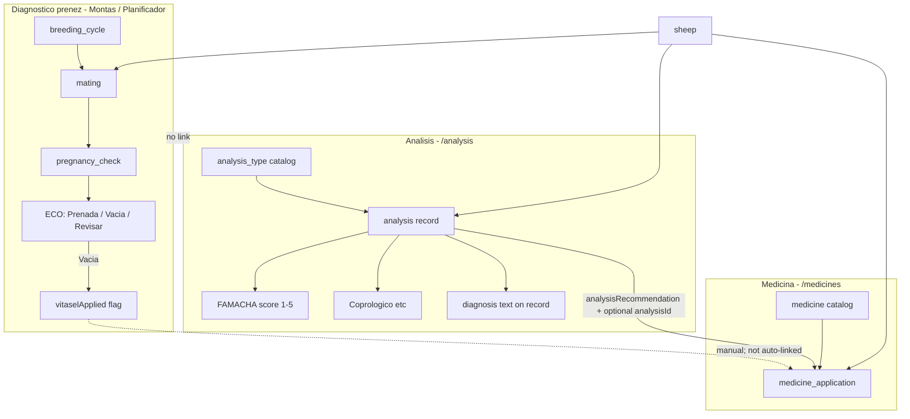
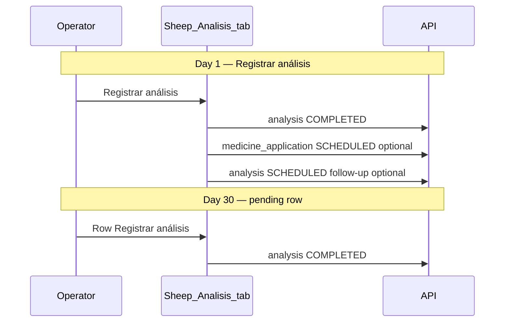
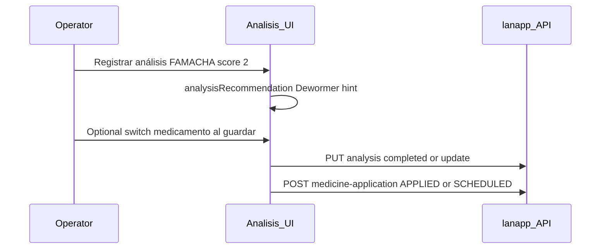

# Análisis, Medicina, and Diagnóstico — how they relate

Canonical reference for three separate workflows that all touch the same sheep but answer different questions.

## Short answer

| Module | Question | Main tables |
|--------|----------|-------------|
| **Diagnóstico de preñez** | Is she pregnant after this monta? | `mating`, `pregnancy_check`, `breeding_cycle` |
| **Análisis** | What do health tests show (anemia, parasites, etc.)? | `analysis_type`, `analysis` |
| **Medicina** | What product was scheduled/applied? | `medicine`, `medicine_application` |

**Análisis → Medicina** recommends treatment from test results and can schedule a dose in one step (operator confirms via checkbox). **Diagnóstico de preñez** uses **ECO only** — not FAMACHA.

---

## 1. Diagnóstico de preñez (reproduction)

After a **monta**, confirm pregnancy with **ECO** (ultrasound) on **Montas** or **Planificador**.

| Piece | API / table | Purpose |
|-------|-------------|---------|
| Monta | `mating` | Ram + ewe + date |
| Chequeo | `pregnancy_check` | `checkType: ECO`, `isPregnant`, lifecycle |
| Plan season | `breeding_cycle` | Groups ewes; mirrors diagnosis fields |

**Results:** Preñada / Vacía / Revisar — updates `sheep.isPregnant`, category, mating phase, parto.

**Vitasel:** When ECO is **Vacía**, the modal has a checkbox → `breeding_cycle.vitaselApplied` / pregnancy-check payload. This is a **reproduction protocol flag**, not an automatic `medicine_application`.

**Not Análisis:** FAMACHA anemia scores belong only under Análisis. See [`MONTAS_LIFECYCLE.md`](./MONTAS_LIFECYCLE.md).

---

## 2. Análisis (health studies)

Schedule and record **health tests** per sheep: FAMACHA (anemia 1–5), coprológico, condición corporal, etc.

| Piece | API / table | Purpose |
|-------|-------------|---------|
| Type catalog | `analysis_type` | Name, kind, optional `recommendedMedicineType` |
| Record | `analysis` | Scheduled → completed; `famachaScore`, `resultValue`, `diagnosis` |

**Naming:** `analysis.diagnosis` is the **text interpretation** of the test (e.g. "Anemia — desparasitar"), **not** pregnancy diagnóstico. `analysis.notes` holds **observations about this specific test** (pre-filled when completing a previously scheduled row).

**Data model over time:**

| Concept | Schema reality |
|---------|----------------|
| One test occasion | One `analysis` row (`SCHEDULED` → `COMPLETED`) |
| Follow-up tests | **New** `analysis` rows (e.g. via **Programar seguimiento** in drawer) |
| Medicine from a test | One or more `medicine_application` rows with `analysisId` FK |

**Recommendation rules** (`@sheep/domain` → `analysisRecommendation()`, re-exported in `lanapp-ui/lib/labels/analysis.ts`):

- FAMACHA ≤ 2 → suggest `MedicineType.DEWORMER`
- Coprológico high load → suggest dewormer
- Custom types → `analysis_type.recommendedMedicineType` when a result is present

UI: [`lanapp-ui/app/analysis/page.tsx`](../lanapp-ui/app/analysis/page.tsx), sheep detail tab **Análisis**.

**Registrar análisis drawer** (sheep tab + `/analysis` single-row): separator layout with switch toggles; four modes:

| Mode | Entry | Title | Save |
|------|-------|-------|------|
| Ad-hoc register | Header **Registrar análisis** | Registrar análisis | Complete test now |
| Ad-hoc schedule | Same header + toggle **Programar para después** | Programar análisis | `SCHEDULED` row, no results |
| Pending row | Icon **Agregar diagnóstico** | Agregar diagnóstico | Complete scheduled row |
| Completed row | Icon **Actualizar diagnóstico** | Actualizar diagnóstico | `updateAnalysis` (same row) |

Sections (when not schedule-only):

1. **Captura del análisis** — fecha, resultado/FAMACHA, diagnóstico, notas del análisis
2. **Aplicación de medicamento** — switch **Medicamento al guardar**; sub-switch **Aplicar ahora** (`APPLIED`) vs programado (`SCHEDULED`); full catalog; hint when recommendation applies
3. **Próximos pasos** — switch **Programar seguimiento** (new `SCHEDULED` row)

**Noticing scheduled analyses (sheep → Análisis tab):**

- Pending rows sort to the top
- **Estado** badge: Programado (blue)
- **Resultado**: Pendiente (gray)
- **Fecha**: scheduled date + “Programado” subline; **Vence hoy** badge when due
- Subtitle: `N programado(s).`
- Row icon: **Agregar diagnóstico** (`FaUserDoctor` / `IconDiagnosis`)

**Individual vs bulk:**

| Surface | Action | Purpose |
|---------|--------|---------|
| Sheep → Análisis | **Registrar análisis** (one header button) | Register now or schedule via drawer toggle |
| Sheep → Análisis row | Icon **Agregar diagnóstico** | Complete pending scheduled row |
| Sheep → Análisis row | Icon **Actualizar diagnóstico** | Edit completed test |
| `/analysis` bulk | **Programar análisis** | Schedule many sheep without results |
| `/analysis` bulk | **Registrar diagnósticos** | Complete many pending rows |
| Sheep → Medicina | **Nueva aplicación** | Apply medicine for this sheep now |
| Sheep → Medicina row | **Registrar aplicación** | Confirm pending dose |
| `/medicines` bulk | **Programar aplicación** / **Registrar aplicaciones** | Herd schedule / batch confirm |

Schedule-only for a single sheep: header **Registrar análisis** → toggle **Programar para después** in the drawer (no second header button). Bulk `/analysis` remains for herd scheduling.

**Sheep detail tabs:**

- **Análisis**: one header **Registrar análisis**; drawer modes for register, schedule-only, add diagnosis, update diagnosis; icon row actions only.
- **Medicina**: one header **Nueva aplicación** (apply-now); row **Registrar aplicación** for pending doses.

**Bulk pages (many sheep):**

| Page | Schedule (future) | Complete (now) |
|------|-------------------|----------------|
| `/analysis` | **Programar análisis** (primary) | **Registrar diagnósticos** (outline, Programados tab) |
| `/medicines` | **Programar aplicación** (primary) | **Registrar aplicaciones** (outline, Programadas tab) |

Sheep tabs do **not** link to bulk pages. Verbs differ on purpose: sheep actions = this animal now; bulk actions = many pending records.

---

## 3. Medicina (treatments)

**Catalog** (`medicine`) + **scheduled/applied doses** per sheep (`medicine_application`).

`medicine_application.analysisId` (nullable FK) links a dose back to the analysis that triggered it. Pregnancy checks are not linked.

---

## Connections in practice

| From | To | Mechanism |
|------|-----|-----------|
| Análisis result | Medicina | Switch **Medicamento al guardar** → `POST /medicine-application` with `analysisId`; **Aplicar ahora** = `APPLIED`, off = `SCHEDULED` |
| Análisis batch | Medicina | Post-save panel → schedule selected sheep |
| Medicinas deep link | Medicina | `/medicines?scheduleSheep=…` still works as manual fallback |
| Diagnóstico Vacía | Vitasel | Checkbox on ECO modal; operator may separately schedule Vitasel in Medicina |
| Diagnóstico | Análisis | None |
| Medicina | Diagnóstico | None |

---

## The word "diagnóstico" in the app

| Context | Meaning | UI action |
|---------|---------|-----------|
| Montas / Planificador | **Pregnancy** outcome (ECO) | **Registrar diagnóstico** (ECO modal) |
| Sheep → Análisis tab | Health test for **this sheep** | **Registrar análisis** (header) |
| Sheep → Análisis row (pending) | Complete scheduled test | Icon **Agregar diagnóstico** |
| Sheep → Análisis row (done) | Edit completed test | Icon **Actualizar diagnóstico** |
| `/analysis` bulk complete | Many sheep pending tests | **Registrar diagnósticos** |
| `/analysis` bulk schedule | Plan future tests | **Programar análisis** |
| Sheep → Medicina tab | Dose for **this sheep** | **Nueva aplicación** |
| `analysis.diagnosis` field | Text **interpretation** of one test | In captura section |
| `analysis.notes` field | Observations of **this test** | In captura section (not próximos pasos) |

**Registrar diagnóstico** on Montas = pregnancy ECO only. **Registrar análisis** on the Análisis tab = health studies (FAMACHA, coprológico, etc.).

---

## By design today (not bugs)

- Treatment is **recommended** from objective results (score/value), not from free-text `diagnosis`.
- Operator must **confirm** medicine via switch; nothing is created silently.
- Vitasel on Vacía is a **boolean flag**, not wired to medicine applications.
- Legacy `/health-check` API remains; new FAMACHA data uses `/analysis` (migration copies old rows).

---

## Related docs

- [`MONTAS_LIFECYCLE.md`](./MONTAS_LIFECYCLE.md) — ECO, Vitasel, montas phases
- [`lanapp-ui/docs/APP_CONTEXT.md`](../lanapp-ui/docs/APP_CONTEXT.md) — API contract §3.6, §3.7, labels
- [`TESTING_SHEEP_LIFECYCLE.md`](./TESTING_SHEEP_LIFECYCLE.md) — end-to-end walkthrough
