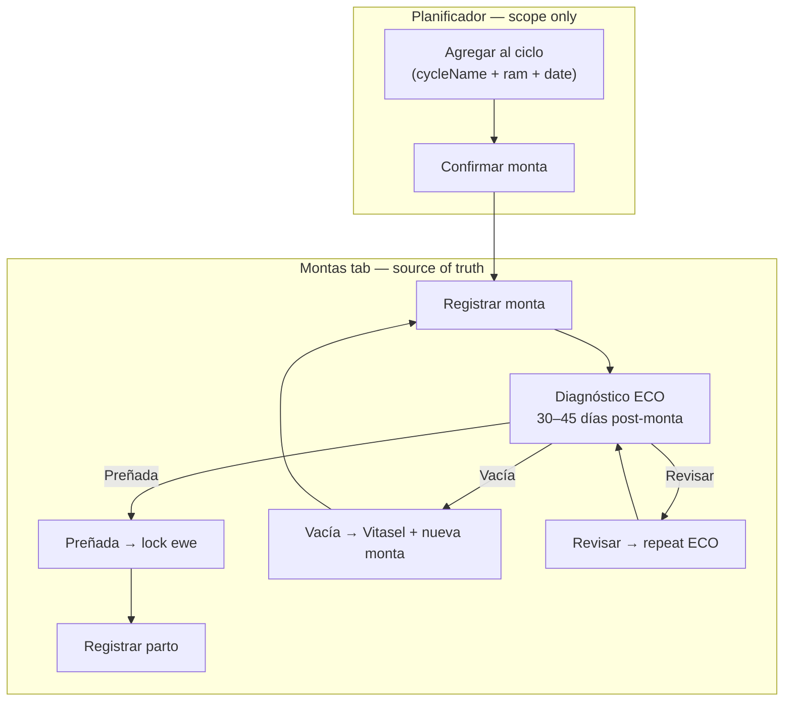

# Montas lifecycle — operator guide

Canonical reference for per-ewe breeding on the **Montas** tab. The **Planificador** is only a season tag that groups many borregas; operational history lives here.

## Flow overview

## Farm reproduction parameters

Configurable under **Configuración → Reproducción** (`GET/PUT /farm-parameters`). Defaults:

| Parameter | Default | Purpose |
|-----------|---------|---------|
| `gestationDays` | **147** | Expected parto date after monta |
| `ecoCheckMinDays` | **30** | Earliest suggested ECO date |
| `ecoCheckMaxDays` | **45** | Latest recommended ECO window |
| `heatCycleDays` | **15** | Soft guidance before remate after Vacía |
| `weaningDays` | **70** | Weaning alerts (aligned with category engine) |

Ultrasound (ECO) is the most reliable pregnancy check at 30–45 days post-monta. Early confirmation supports nutrition and health management for the ~147-day gestation.

## Step-by-step rules

### 1. Registrar monta

**Who can be mated (ewe):** activa, category **BORREGA** or **OVEJA VACÍA**, `isPregnant = false`.

**Who can mate (ram):** activa, category **REPRODUCTOR**.

Creates a `mating` row (status **Pendiente**). Category does **not** change until diagnosis.

### 2. Diagnóstico de preñez — ECO

Pregnancy diagnosis on Montas / Planificador uses **ECO only** (ecógrafo):

| Type | Method |
|------|--------|
| **ECO** | Ecógrafo (ultrasound) — primary and follow-up checks |

> **Note:** **FAMACHA** (anemia score 1–5 on the eyelid) lives under **Análisis** (`/analysis`) — it is **not** a pregnancy test.

Legacy `pregnancy_check` rows with `FAMACHA` or `Control Monta` are migrated to **ECO** in the database.

| Result | Meaning | Same mating | Ewe lock |
|--------|---------|-------------|----------|
| **Preñada** | Confirmed pregnant | Follow-up **Revisar** or **Vacía** (loss) | **Locked** — no new montas |
| **Vacía** | Not pregnant (definitive) | **Terminal** for this mating | Unlocked — Vitasel + **new monta** |
| **Revisar** | Inconclusive | Another ECO allowed | Not pregnant until confirmed |

**When to use what**

| Situation | Where |
|-----------|--------|
| Pregnancy check ~30–45 days post-monta | **Montas** / **Planificador** → ECO |
| Gestation follow-up | **Montas** → ECO (Revisar / Vacía) |
| Monthly anemia round (eyelid score 1–5) | **Análisis** page or sheep **Análisis** tab |

The UI shows a suggested ECO window and warns (soft) if the check date falls outside the configured range.

### 3. Preñada → lock

When ECO is **Preñada**:

- `sheep.isPregnant = true`, category → **OVEJA PREÑADA** / **BORREGA PREÑADA**
- Register monta form is **disabled**
- Further diagnoses on **this mating**: **Revisar** (gestation follow-up) or **Vacía** (loss / error) only — not another Preñada
- **Revisar after Preñada** schedules the next control but **does not** clear `isPregnant` or change category
- **Vacía after Preñada** requires confirmation; unlocks the ewe for a new monta

### 4. Vacía → Vitasel + remate

When ECO is **Vacía**:

- This mating is **Inefectiva** — no more diagnoses on this row
- Apply **Vitasel** (checkbox in diagnosis modal)
- Register a **new monta** (optionally after ~15 days — heat cycle parameter)
- Do **not** try to re-diagnose the same mating row

### 5. Registrar parto

Only when phase is **Preñada**. Sets lactation category (**OVEJA LACTANCIA**). Lambs are registered manually in **Nueva oveja**.

### 6. After lactation

When a linked lamb is **destetado**, the ewe returns to **OVEJA VACÍA** and can enter a new monta cycle.

## Planificador role

| Planificador | Montas tab |
|--------------|------------|
| Bulk schedule ewes into `cycleName` (e.g. `2026-A`) | Per-ewe history and actions |
| Optional ram, date, Vitasel flag | Register monta, ECO, parto |
| **Confirmar monta** → creates linked `mating` row | All diagnosis and parto |

After confirming a planned cycle, continue on the ewe’s **Montas** tab for ECO and parto.

## Mating phases (badges)

| Phase | Label | Next action |
|-------|-------|-------------|
| `awaiting_diagnosis` | Pendiente diagnóstico | ECO in suggested window |
| `recheck` | Revisar | Repeat ECO |
| `pregnant` | Preñada | Registrar parto |
| `empty` | Vacía | Vitasel + nueva monta |
| `delivered` | Parto registrado | — |

## Related docs

- Testing walkthrough: [`TESTING_SHEEP_LIFECYCLE.md`](./TESTING_SHEEP_LIFECYCLE.md)
- UI/API contract: [`lanapp-ui/docs/APP_CONTEXT.md`](../lanapp-ui/docs/APP_CONTEXT.md) §16
- Architecture: [`sheep/docs/ARCHITECTURE_PLAN.md`](../sheep/docs/ARCHITECTURE_PLAN.md)

## Future: litter size

ECO can detect singles vs multiples. A `litterSize` field on pregnancy checks may be added later; not required for the core Montas flow.
