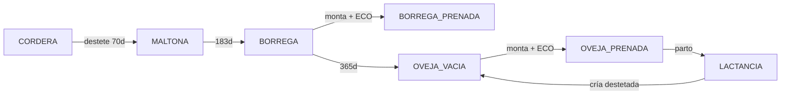
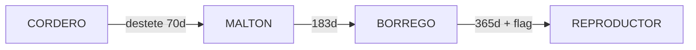

# Sheep lifecycle — manual test guide

Step-by-step guide for testing category changes, breeding, destete, and mother lactation in Lanapp **without waiting real months**. The main technique is creating animals from scratch and **editing `Fecha de nacimiento`** to simulate age.

**Prerequisites**

```bash
cd webapp
npm install && npm run build:packages
cd lanapp && docker compose up -d && cd ..
npm run dev:api    # terminal 1 — port 4001
npm run dev:ui     # terminal 2 — port 3000
```

Open [http://localhost:3000](http://localhost:3000).

Use unique aretes for each test run (e.g. `TEST-MOM-01`, `TEST-RAM-01`) so you do not collide with real data.

---

## Dates to use (copy into **Fecha de nacimiento**)

**Reference “today” for this guide:** `2026-06-13`  
Recalculate if you run tests on another day: subtract the same number of days from your current date.

| Step / target | Days old | **Birth date to enter** |
|---------------|----------|-------------------------|
| Newborn (create) | 0 | `2026-06-13` |
| Young cordera/cordero | 30 | `2026-05-14` |
| Destete alert (≥70 d) | 80 | `2026-03-25` |
| Maltona/Maltón (after destete) | 120 | `2026-02-13` |
| Borrega / Borrego | 250 | `2025-10-06` |
| Oveja vacía / breeding age | 400 | `2025-05-09` |
| Reproductor ram (same age + flag) | 400 | `2025-05-09` |

**Event dates (monta, ECO, parto, destete):** use `2026-06-13` unless you are replaying an older scenario.

| Event | **Date to enter** |
|-------|-------------------|
| Fecha de monta | `2026-06-13` |
| Fecha ECO | `2026-06-13` |
| Fecha parto | `2026-06-13` |
| Fecha destete | `2026-06-13` |
| Lamb birth (same day as parto) | `2026-06-13` → then edit to `2026-03-25` before destete |

---

## Age thresholds (official rules)

| Threshold | Days | What changes |
|-----------|------|----------------|
| Destete | **70** | Lamb needs a **destete record** to become Maltón / Maltona |
| Borrego / Borrega | **183** (~6 months) | Age-only step |
| Oveja / Reproductor | **365** (~12 months) | Female → oveja; male → reproductor only if flagged |
| Cuarentena | **7** | Newborns (`Nacido en granja`) stay in quarantine 7 days from birth |

Category engine: `lanapp/src/domain/category.engine.ts`

---

## Date cheat sheet

Concrete dates below assume **today = 2026-06-13**.

| Target category | Sex | **Fecha de nacimiento** | Extra steps |
|-----------------|-----|-------------------------|-------------|
| CORDERA / CORDERO | either | `2026-05-14` | — |
| Destete alert (70+ d) | either | `2026-03-25` | No destete yet |
| CORDERA DESTETADA (MALTONA) / CORDERO DESTETADO (MALTÓN) | either | `2026-02-13` | **Register destete** on `2026-06-13` |
| BORREGA / BORREGO | F / M | `2025-10-06` | — |
| OVEJA VACÍA | F | `2025-05-09` | — |
| BORREGA PREÑADA | F | `2025-10-06` | Monta + ECO **Preñada** |
| OVEJA PREÑADA | F | `2025-05-09` | Monta + ECO **Preñada** |
| OVEJA LACTANCIA | F | `2025-05-09` | Monta + ECO + **Parto** on `2026-06-13` |
| REPRODUCTOR | M | `2025-05-09` | Editar → **Marcar como reproductor** |

**Important:** Maltón / Maltona is **not** automatic at 70 days. You must register destete (`/weaning` → **Destetar**). Until then, an 80-day-old lamb stays CORDERO/CORDERA even though it appears in destete alerts.

**Category sync:** After saving a birth-date change, **open the sheep detail page** (or refresh it). `GET /sheep/:id` recalculates category from age + flags + destete record.

---

## Lifecycle diagrams

### Female (ewe → mother)



### Male (lamb → borrego → reproductor)



---

## Test A — Female: from lamb to mother and back

Goal: walk one ewe through **Cordera → Maltona → Borrega → Oveja preñada → Lactancia → Oveja vacía** using date edits and UI flows.

### A1. Create the ewe

1. **Ovejas** → **Nueva oveja**
2. Fill in:

| Field | Value |
|-------|-------|
| Arete | `TEST-MOM-01` |
| Sexo | Hembra |
| Fecha de nacimiento | `2026-06-13` (change in next steps) |
| Peso inicial | `3.5` |
| Tipo de registro | **Comprada** (avoids cuarentena while testing) |

3. Save → open the new detail page.

### A2. Young cordera

1. **Editar** → **Fecha de nacimiento** → `2026-05-14` → Guardar.
2. Reopen detail → expect **CORDERA**, edad ~30 d.

### A3. Destete alert → Maltona

1. **Editar** → **Fecha de nacimiento** → `2026-03-25` → Guardar.
2. **Alertas destete** (`/weaning`) → sheep should appear.
3. Select → **Destetar** → fecha destete `2026-06-13`, peso e.g. `18.5` → **Registrar destete**.
4. Reopen detail → **CORDERA DESTETADA (MALTONA)**.
5. **Pesos** tab → row with note `Peso de destete`.
6. **General** tab → **Historial de destete** shows the record.

### A4. Borrega

1. **Editar** → **Fecha de nacimiento** → `2025-10-06` → Guardar.
2. Reopen detail → **BORREGA**.

### A5. Oveja vacía (breeding age)

1. **Editar** → **Fecha de nacimiento** → `2025-05-09` → Guardar.
2. Reopen detail → **OVEJA VACÍA**.

### A6. Create a reproductor (partner)

1. **Nueva oveja** → male `TEST-RAM-01`, **Fecha de nacimiento** `2025-05-09`, tipo **Comprada**, peso `45`.
2. **Editar** → check **Marcar como reproductor** → Guardar.
3. Reopen detail → **REPRODUCTOR** (green badge in header).

### A7. Monta + ECO → Oveja preñada

> **Canonical guide:** [`MONTAS_LIFECYCLE.md`](./MONTAS_LIFECYCLE.md) — Montas tab is the source of truth; Planificador is only a season tag (`cycleName`).

| | **Montas** (sheep detail) | **Planificador** (`/planner`) |
|--|---------------------------|-------------------------------|
| Role | Per-ewe history + ECO + parto | Bulk schedule + confirm monta |
| What it creates | `mating` row | `breeding_cycle` row (scope tag) |
| Diagnosis / parto | **Here** | Confirm monta, then continue on Montas tab |
| Best for | Step-by-step test (recommended) | Many ewes in e.g. `2026-A` |

**ECO timing:** ultrasound check recommended **30–45 days** after monta (farm defaults in **Configuración → Reproducción**). For quick tests you can use any date; the UI shows a soft warning outside the window.

#### Option A — Montas tab (recommended)

On **TEST-MOM-01** detail → tab **Montas**:

1. **Reproductor** → pick `TEST-RAM-01`, **fecha de monta** `2026-06-13` → **Registrar monta**.
2. On the new row → **Diagnóstico** → tipo **ECO**, **fecha** `2026-07-13` (~30 d), resultado **Preñada** → Guardar.
3. Refresh sheep header → **OVEJA PREÑADA**; register form is **disabled** (preñada lock).

#### Option B — Planificador (bulk schedule)

1. Go to **`/planner`** → **Agregar ovejas al ciclo** → cycle `2026-A`, ram, date, check **TEST-MOM-01**.
2. On **TEST-MOM-01** Montas tab → **Confirmar monta** on the planned cycle row.
3. **Diagnóstico** on the mating row (same as Option A step 2).

**If “nothing happened” after save:**

- Ewe was not **checked** in the Ovejas list (save button stays disabled until at least one is selected).
- **Nombre del ciclo** filter at the top of the page hides rows — click **Limpiar** or type the exact cycle name you used.
- Ewe must be **OVEJA VACÍA** or **BORREGA**, activa, not already pregnant.
- After confirm, diagnosis happens on the **Montas** tab mating row, not only on the planner table.

> **Parto (A8):** use **Registrar parto** on the Montas tab mating row.

### A8. Parto → Lactancia

Still on **Montas** tab, same mating row:

1. **Parto** → **fecha parto** `2026-06-13` → Guardar.
2. Refresh detail → **OVEJA LACTANCIA** (pink banner on Montas tab).

### A9. Register a lamb and end lactation

Parto does **not** auto-create lambs in the UI yet. Create the offspring manually:

1. **Nueva oveja** → `TEST-LAMB-01`, hembra, **Fecha de nacimiento** `2026-06-13`, peso `3.2`, tipo **Nacido en granja**.
2. (Optional) Link mother via API so destete clears lactation automatically — see [API snippet](#api-link-lamb-to-mother) below.
3. **Editar** lamb → **Fecha de nacimiento** `2026-03-25` (destete age).
4. **Alertas destete** → destete on `2026-06-13`.
5. Reopen **TEST-MOM-01** → should be **OVEJA VACÍA** again (lactation ends when a linked lamb is destetado).

### A10. Borrega preñada (younger path)

Use **Fecha de nacimiento** `2025-10-06` (steps A4–A7). After ECO **Preñada** → **BORREGA PREÑADA** (not OVEJA PREÑADA).

---

## Test B — Male: from lamb to borrego to reproductor

Goal: **Cordero → Maltón → Borrego → Reproductor**.

### B1. Create ram

1. **Nueva oveja** → `TEST-BOR-01`, macho, **Fecha de nacimiento** `2026-06-13`, peso `4.0`, tipo **Comprada**.

### B2. Cordero → Maltón

1. **Editar** → **Fecha de nacimiento** `2026-03-25` → Guardar → appears in **Alertas destete**.
2. **Destetar** on `2026-06-13`, peso e.g. `22` → **CORDERO DESTETADO (MALTÓN)**.

### B3. Borrego

1. **Editar** → **Fecha de nacimiento** `2025-10-06` → Guardar.
2. Reopen detail → **BORREGO**.
3. Header **Reproductor** badge should say **No** (not eligible for planner yet).

### B4. Reproductor

1. **Editar** → **Fecha de nacimiento** `2025-05-09` → Guardar → still **BORREGO** until flagged.
2. **Editar** → **Marcar como reproductor** → Guardar.
3. Reopen detail → **REPRODUCTOR**, badge **Sí**, eligible in **Planificador** → **Agregar al ciclo**.

### B5. Planner check

1. `/planner` → **Agregar al ciclo** → ram picker should include `TEST-BOR-01`.
2. Only **REPRODUCTOR** males appear for monta (not plain BORREGO).

---

## Test C — Quick smoke checklist

| # | Action | Birth / event date | Expected |
|---|--------|-------------------|----------|
| 1 | New lamb | `2026-05-14` | CORDERO / CORDERA |
| 2 | No destete yet | `2026-03-25` | Listed in `/weaning` pendientes |
| 3 | Destete on `2026-06-13` | `2026-03-25` or `2026-02-13` | Maltona/Maltón + Pesos entry |
| 4 | Borrega / borrego | `2025-10-06` | Borrega / Borrego |
| 5 | Ewe + ECO preñada | `2025-05-09` | Oveja preñada |
| 6 | Parto `2026-06-13` | — | Oveja lactancia |
| 7 | Destete linked lamb | lamb `2026-03-25` | Mother → oveja vacía |
| 8 | Ram + reproductor flag | `2025-05-09` | Reproductor in planner |

---

## Tips and gotchas

**Cuarentena** — `Nacido en granja` + birth within last 7 days → estado **Cuarentena**. Use **Comprada** for faster tests, or set birth date older than 7 days.

**Peso al registro** — Creating a sheep always adds a weight row on the birth date (`Peso al registro`). Destete upserts the same day or adds a new row with `Peso de destete`.

**Edit birth date, not category** — Category is computed. Do not expect to pick “Maltona” manually in the form.

**Montas eligibility**

| Role | Requirement |
|------|-------------|
| Ewe | Activa, not pregnant, category **BORREGA** or **OVEJA VACÍA** |
| Ram | Activa, category **REPRODUCTOR** |

**Gestación** — default **147 days** (`gestationDays` in **Configuración → Reproducción** / `GET /farm-parameters`). UI suggests expected parto from monta date. For testing, any parto date is accepted.

**Destetados recientes** — `/weaning` → tab **Destetados recientes** → filter last 10 days or custom range.

---

## API snippet: link lamb to mother

The create form does not expose `motherId` yet. To test lactation end on destete:

```bash
# Replace IDs and token after creating sheep in the UI
curl -X POST http://localhost:4001/sheep \
  -H "Content-Type: application/json" \
  -H "Authorization: Bearer YOUR_TOKEN" \
  -d '{
    "tag": "TEST-LAMB-API",
    "gender": "Female",
    "breed": "Suffolk",
    "birthDate": "2026-06-13",
    "weight": 3.1,
    "recordType": "Born on Farm",
    "motherId": "MOTHER_UUID_HERE",
    "fatherId": "FATHER_UUID_HERE"
  }'
```

Then destete the lamb in the UI; the mother’s `deliveryDate` clears and category returns to **OVEJA VACÍA**.

---

## Related docs

- **Montas lifecycle (canonical):** [`MONTAS_LIFECYCLE.md`](./MONTAS_LIFECYCLE.md)
- UI contract: [`lanapp-ui/docs/APP_CONTEXT.md`](../lanapp-ui/docs/APP_CONTEXT.md)
- Architecture & official flows: [`sheep/docs/ARCHITECTURE_PLAN.md`](../sheep/docs/ARCHITECTURE_PLAN.md)
- Category unit tests: [`lanapp/src/domain/category.engine.test.ts`](../lanapp/src/domain/category.engine.test.ts)
