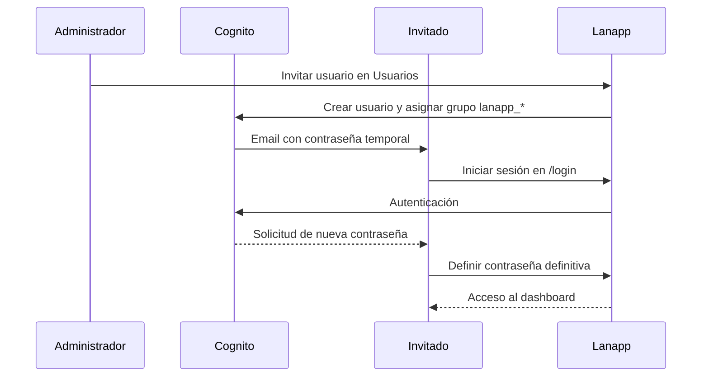
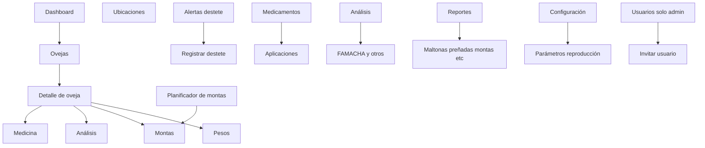
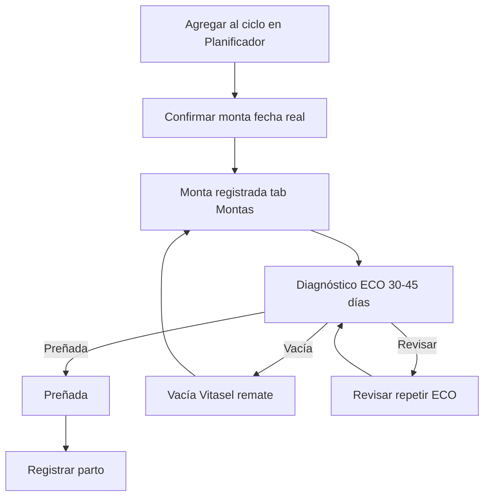
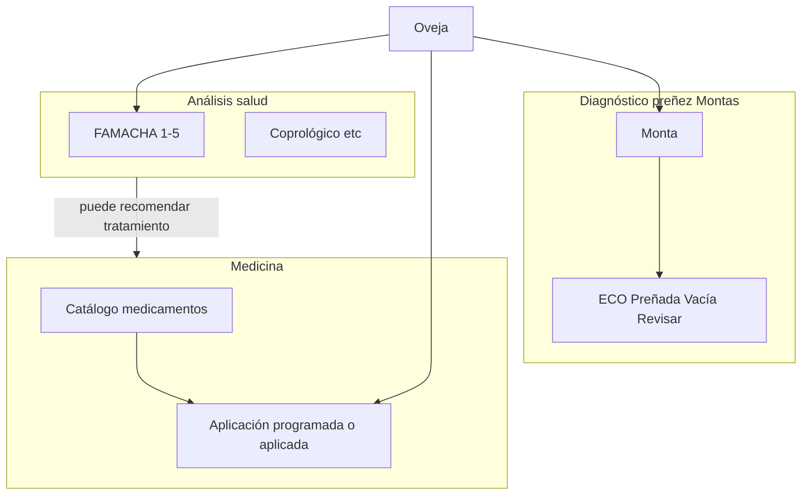

# Lanapp — Guía de usuario

> **Producto:** Granja San Alfonso — gestión de granja ovina (Riobamba, Ecuador)  
> **Audiencia:** administradores, veterinarios y operarios de campo

Documentación operativa con flujos, diagramas y permisos por rol. Para detalle técnico de permisos y validaciones, ver [ROLES.md](./ROLES.md) y [VALIDACIONES.md](./VALIDACIONES.md).

---

## 1. Introducción

Lanapp permite registrar ovejas, pesos, montas, análisis de salud (FAMACHA), medicamentos, destetes e informes de reproducción. El acceso es **solo por invitación**: un administrador crea usuarios y asigna un rol.

### Roles disponibles

| Rol en la app | Etiqueta en pantalla | Grupo Cognito |
|---------------|---------------------|---------------|
| `admin` | Administrador | `lanapp_admin` |
| `veterinario` | Veterinario | `lanapp_veterinario` |
| `operario` | Operario | `lanapp_operario` |

### Glosario

| Término | Significado |
|---------|-------------|
| **Operario** | Trabajador de campo. En conversación a veces se dice *operador*; en el sistema el rol es **Operario** (`operario`). |
| **Monta** | Evento de reproducción entre carnero y oveja. |
| **ECO** | Ecografía / diagnóstico de preñez (30–45 días post-monta). |
| **FAMACHA** | Análisis de anemia (puntuación 1–5). |
| **Destete** | Separación del cordero de la madre; se registra peso al destete. |

---

## 2. Acceso a la aplicación

No hay registro público. El flujo típico es:

**Pasos para el invitado**

1. Abrir el enlace de Lanapp e ir a **Iniciar sesión**.
2. Usar el email y la contraseña temporal del correo.
3. Definir una contraseña nueva cuando el sistema lo pida.
4. Entrar al **Dashboard**.

**Recuperar contraseña:** en la pantalla de login, **Olvidé mi contraseña** → código por email → nueva contraseña.

Detalle técnico: [AUTH.md](./AUTH.md).

---

## 3. Mapa de la aplicación

Navegación principal (menú lateral):

| Módulo | Ruta | Para qué sirve |
|--------|------|----------------|
| Dashboard | `/dashboard` | Indicadores generales de la granja |
| Ovejas | `/sheep` | Inventario; alta, edición y ficha por animal |
| Ubicaciones | `/locations` | Potreros y sitios de la finca |
| Planificador | `/planner` | Temporadas de monta y confirmación |
| Alertas destete | `/weaning` | Ovejas/corderos listos para destete |
| Medicamentos | `/medicines` | Catálogo y aplicaciones |
| Análisis | `/analysis` | FAMACHA, coprológico, etc. |
| Reportes | `/reports/*` | Maltonas, preñadas, montas, reproductores, madres |
| Configuración | `/settings` | Parámetros de reproducción y razas |
| Usuarios | `/users` | Invitar y listar usuarios (**solo admin**) |

---

## 4. Flujos operativos

### 4.1 Alta y edición de oveja

1. Ir a **Ovejas** → **Nueva oveja** (o editar desde la ficha).
2. Completar: **arete (tag)**, raza, sexo, fecha de nacimiento, peso inicial, tipo de registro.
3. Opcional: nombre, ubicación, padre/madre, notas.
4. Guardar.

La **categoría** y el **estado** (activa, vendida, etc.) los calcula el sistema según edad, sexo y eventos. Ver [VALIDACIONES.md § Oveja](./VALIDACIONES.md#2-oveja).

---

### 4.2 Registro de peso

1. Abrir la ficha de la oveja → pestaña **Pesos**.
2. **Registrar peso**: fecha y peso (kg).
3. El sistema puede calcular **ganancia diaria** respecto al peso anterior.

**Restricción:** si la oveja no está **Activa**, el botón queda deshabilitado con el mensaje *"La oveja no está activa"*.

---

### 4.3 Reproducción: planificador → monta → ECO → parto

Flujo resumido (detalle en [MONTAS_LIFECYCLE.md](../../docs/MONTAS_LIFECYCLE.md)):

| Paso | Dónde | Qué registrar |
|------|-------|---------------|
| Planificar ciclo | Planificador | Nombre de ciclo, carnero, fecha planificada |
| Confirmar monta | Planificador o Montas | Fecha real de la monta |
| ECO | Tab Montas | Preñada / Vacía / Revisar (ventana 30–45 días*) |
| Parto | Tab Montas | Fecha de parto desde monta preñada |

\*Ventana configurable en **Configuración → Reproducción** (`ecoCheckMinDays`, `ecoCheckMaxDays`).

---

### 4.4 Análisis vs medicina vs diagnóstico de preñez

Son **tres flujos distintos** que comparten la misma oveja:

| Pregunta | Módulo | Ejemplo |
|----------|--------|---------|
| ¿Está preñada? | Montas / ECO | Ultrasonido 30–45 días post-monta |
| ¿Cómo está su salud? | Análisis | FAMACHA score 1–5 |
| ¿Qué medicamento se aplicó? | Medicamentos | Vitasel, desparasitante, etc. |

Guía completa: [ANALYSIS_MEDICINE_DIAGNOSIS.md](../../docs/ANALYSIS_MEDICINE_DIAGNOSIS.md).

---

### 4.5 Análisis FAMACHA y otros

1. **Análisis** (módulo global) o pestaña **Análisis** en la ficha de la oveja.
2. Programar análisis: tipo, fecha.
3. Al completar: **puntuación FAMACHA 1–5** (1 = sana, 5 = anemia grave), diagnóstico y notas.
4. Opcional: programar medicamento recomendado desde el resultado.

Validaciones: [VALIDACIONES.md § Análisis](./VALIDACIONES.md#5-análisis).

---

### 4.6 Medicamentos

1. **Medicamentos** → catálogo (tipo, nombre, dosis).
2. **Programar aplicación** para una oveja (fecha, medicamento).
3. Marcar como **aplicada** cuando se administra en campo.

Desde análisis completado se puede vincular una aplicación al resultado.

---

### 4.7 Destete

1. **Alertas destete** lista animales según parámetro `weaningDays` (default 70 días).
2. Registrar destete: fecha y **peso al destete** (kg).

---

### 4.8 Invitar usuario (administrador)

1. **Usuarios** → **Invitar usuario**.
2. Email y **rol**: Administrador, Veterinario u Operario.
3. Cognito envía contraseña temporal al correo.

Solo usuarios con rol **admin** ven el menú Usuarios y pueden invitar.

---

## 5. Estados de la oveja

| Estado | Significado | Impacto en acciones |
|--------|-------------|---------------------|
| **Activa** | En el rebaño | Pesos, análisis y medicina habilitados |
| **Inactiva** | Fuera de operación normal | Acciones de salud/peso bloqueadas |
| **Vendida** | Comercializada | Bloqueadas |
| **Fallecida** | Deceased | Bloqueadas |
| **Cuarentena** | Aislamiento temporal | Bloqueadas hasta fin de cuarentena |

---

## 6. Qué puede hacer cada rol

### Hoy (comportamiento actual)

Cualquier usuario **autenticado** puede usar casi todos los módulos. Solo estas acciones están limitadas a **admin**:

| Acción | Admin | Veterinario | Operario |
|--------|:-----:|:-----------:|:--------:|
| Invitar / listar usuarios | Sí | No | No |
| Importar Excel (inventario, FAMACHA) | Sí | No | No |
| Editar parámetros de reproducción | Sí | No* | No* |
| Registrar pesos, montas, destete | Sí | Sí | Sí |
| Análisis y medicina | Sí | Sí | Sí |
| Reportes | Sí | Sí | Sí |
| Alta/edición de ovejas | Sí | Sí | Sí |

\*En la UI todos ven Configuración; guardar parámetros de reproducción devuelve error **403** si no eres admin (en producción con auth activa).

> **Importante:** Los roles Veterinario y Operario se asignan al invitar, pero **aún no restringen** el resto de pantallas. El diseño objetivo está en [ROLES.md](./ROLES.md).

### Objetivo (resumen)

| Rol | Enfoque |
|-----|---------|
| **Administrador** | Usuarios, importaciones, configuración de granja, acceso total |
| **Veterinario** | Salud, reproducción, análisis, medicina, reportes |
| **Operario** | Operaciones de campo: pesos, montas, destete, ubicaciones |

Matriz detallada: [ROLES.md § Matriz propuesta](./ROLES.md#matriz-propuesta-diseño-objetivo).

---

## 7. Documentación relacionada

| Documento | Contenido |
|-----------|-----------|
| [ROLES.md](./ROLES.md) | Permisos actuales vs propuestos; plan RBAC |
| [VALIDACIONES.md](./VALIDACIONES.md) | Campos, rangos y reglas de formularios |
| [AUTH.md](./AUTH.md) | Cognito, variables de entorno, bootstrap admin |
| [MONTAS_LIFECYCLE.md](../../docs/MONTAS_LIFECYCLE.md) | Ciclo de montas y ECO |
| [ANALYSIS_MEDICINE_DIAGNOSIS.md](../../docs/ANALYSIS_MEDICINE_DIAGNOSIS.md) | Tres flujos de salud/reproducción |
| [APP_CONTEXT.md](./APP_CONTEXT.md) | Contrato API (desarrollo) |
