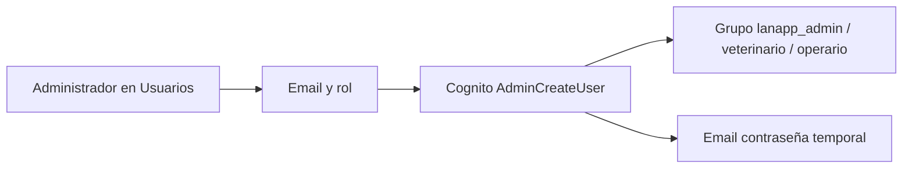
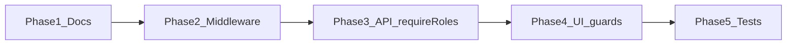

# Lanapp — Roles y permisos

> Bilingüe: **Parte A** para usuarios y producto (español). **Parte B** para desarrollo (English).

Documentos relacionados: [GUIA_USUARIO.md](./GUIA_USUARIO.md) · [VALIDACIONES.md](./VALIDACIONES.md) · [AUTH.md](./AUTH.md)

---

# Parte A — Español

## Definición de roles

| Rol (código) | Etiqueta UI | Grupo Cognito | Perfil |
|--------------|-------------|---------------|--------|
| `admin` | Administrador | `lanapp_admin` | Configuración de granja, usuarios, importaciones |
| `veterinario` | Veterinario | `lanapp_veterinario` | Salud, reproducción, análisis, medicina, reportes |
| `operario` | Operario | `lanapp_operario` | Operaciones de campo: pesos, montas, destete, ubicaciones |

**Nota:** En conversación se puede decir *operador*; en código y Cognito el rol es **`operario`**.

**Extra:** el grupo Cognito `platform_admin` se trata como administrador en la app.

---

## Flujo de invitación por rol



1. Admin abre **Usuarios** → **Invitar usuario**.
2. Elige rol: Administrador, Veterinario u Operario.
3. Cognito crea el usuario y lo añade al grupo `lanapp_<rol>`.
4. El invitado recibe email y completa el primer acceso (ver [GUIA_USUARIO.md § Acceso](./GUIA_USUARIO.md#2-acceso-a-la-aplicación)).

---

## Permisos hoy (comportamiento actual)

Solo **`admin`** está reforzado en código. El resto de módulos exigen login válido, no un rol concreto.

| Módulo / acción | Admin | Veterinario | Operario | Dónde se aplica |
|-----------------|:-----:|:-----------:|:--------:|-----------------|
| Invitar / listar usuarios | Sí | No | No | API Next.js + menú lateral |
| Import Excel (inventario, FAMACHA) | Sí | No | No | API `lanapp` |
| Editar parámetros reproducción (`PUT /farm-parameters`) | Sí | No | No | API `lanapp` |
| Ver parámetros reproducción | Sí | Sí* | Sí* | UI visible; guardar = 403 si no admin |
| CRUD ovejas, pesos, montas, ECO | Sí | Sí | Sí | Solo JWT |
| Análisis, medicina, destete | Sí | Sí | Sí | Solo JWT |
| Reportes | Sí | Sí | Sí | Solo JWT |
| Ubicaciones | Sí | Sí | Sí | Solo JWT |
| Protección de rutas sin sesión | Parcial** | Parcial** | Parcial** | `middleware.ts` no conectado |

\*Cualquier usuario autenticado puede abrir Configuración; solo admin puede persistir cambios en producción.  
\*\*Existe lógica en `proxy.ts` pero no está activa como middleware de Next.js.

---

## Matriz propuesta (diseño objetivo)

> **No implementado.** Referencia para priorizar RBAC. Celdas con *TBD* requieren validación de producto.

Leyenda: **V** ver · **C** crear · **E** editar · **D** eliminar · **B** operaciones masivas · **—** sin acceso

| Módulo | Admin | Veterinario | Operario |
|--------|-------|-------------|----------|
| **Usuarios** (invitar/listar) | V C E D | — | — |
| **Import Excel** | V C | — | — |
| **Parámetros reproducción** | V E | V | V |
| **Configuración razas** | V E | V | V |
| **Dashboard** | V | V | V |
| **Ovejas** | V C E D | V C E D | V C E —* |
| **Pesos** | V C E D | V C E D | V C E D |
| **Planificador / montas** | V C E D B | V C E D B | V C E B |
| **ECO / parto** | V C E | V C E | V C* |
| **Análisis FAMACHA** | V C E D B | V C E D B | V C* E* |
| **Medicamentos (catálogo)** | V C E D | V C E D | V |
| **Medicina (aplicaciones)** | V C E D B | V C E D B | V C E |
| **Alertas destete / destete** | V C E B | V C E B | V C E B |
| **Ubicaciones** | V C E D | V | V C E |
| **Reportes — operativos** | V | V | V |
| **Reportes — administrativos** | V | V* | —* |

\* **TBD:** eliminar ovejas (operario); confirmar diagnóstico FAMACHA (operario programa, veterinario confirma); alcance exacto de reportes por rol.

### Principios del diseño objetivo

| Rol | Principio |
|-----|-----------|
| **Administrador** | Control total + usuarios + importaciones + parámetros de granja |
| **Veterinario** | Decisiones clínicas/reproductivas; análisis y medicina sin gestión de usuarios |
| **Operario** | Captura en campo; sin eliminar registros críticos ni administrar usuarios |

---

## Roadmap de adopción (producto)

| Fase | Entrega | Resultado para usuarios |
|------|---------|-------------------------|
| 1 | Documentación (actual) | Claridad sobre hoy vs objetivo |
| 2 | Middleware de sesión | Pantallas privadas redirigen a login |
| 3 | Permisos en API | Operario/veterinario reciben 403 donde corresponda |
| 4 | Permisos en UI | Menú y botones ocultos según rol |
| 5 | Pruebas automatizadas | Regresiones de permisos detectadas en CI |

Detalle técnico: [Parte B](#parte-b--english-developers).

---

# Parte B — English (developers)

## Role constants

Source: `lanapp-ui/lib/auth/constants.ts`

```typescript
export const LANAPP_ROLES = ['admin', 'veterinario', 'operario'] as const;
export const COGNITO_APP_PREFIX = 'lanapp_';
// Groups: lanapp_admin, lanapp_veterinario, lanapp_operario
// platform_admin → treated as admin
```

Terraform groups: `webapp-infra/iac/src/v1/5_cognito.tf` (`lanapp_cognito_groups`).

---

## Current enforcement (as-is)

| Layer | Mechanism | Files |
|-------|-----------|-------|
| Next.js admin API | `requireAdmin()` — checks `roles.includes('admin')` | `lanapp-ui/lib/auth/require-admin.ts`, `app/api/admin/users/route.ts` |
| UI navigation | Hide `/users` unless admin | `lanapp-ui/components/sidebar-content.tsx` |
| Express API | `requireRoles('admin')` on 4 route handlers | `lanapp/src/routes/import.ts` (3), `farm-parameters.ts` (1) |
| All other lanapp routes | `verifyToken` only — any valid JWT | ~15 routers under `lanapp/src/routes/` |
| Route guard | **Not wired** | `lanapp-ui/proxy.ts` exists; no `middleware.ts` export |
| Dev bypass | Mock admin user | `SKIP_AUTH=true` (API), `NEXT_PUBLIC_SKIP_AUTH=true` (UI) |

### Admin-only API endpoints

| Method | Path | Middleware |
|--------|------|------------|
| POST | `/import/inventory/preview` | `verifyToken`, `requireRoles('admin')` |
| POST | `/import/inventory` | same |
| POST | `/import/famacha` | same |
| PUT | `/farm-parameters/` | same |

### Admin-only Next.js routes

| Method | Path |
|--------|------|
| GET, POST | `/api/admin/users` |

---

## Gaps

1. **`veterinario` and `operario` are assigned at invite time but not enforced** on farm data endpoints.
2. **`/users` page has no client-side admin redirect** — non-admins get API 403 only.
3. **`proxy.ts` session guard is inactive** — unauthenticated users may load page shells (API calls still fail without JWT).
4. **Settings reproduction form** is visible to all; `PUT /farm-parameters` returns 403 for non-admins when auth is enabled.

---

## RBAC adoption roadmap (future implementation)



| Phase | Work | Key changes |
|-------|------|-------------|
| **1** | Docs (this delivery) | `GUIA_USUARIO.md`, `ROLES.md`, `VALIDACIONES.md` |
| **2** | Session guard | Export `proxy` from `middleware.ts`; redirect unauthenticated users |
| **3** | API RBAC | `requireRoles(...)` per route group; shared policy map |
| **4** | UI RBAC | `useAuth()` with roles; hide nav/actions; page guards on `/users`, settings tabs |
| **5** | Tests | Integration tests per role for critical endpoints |

### Suggested policy helper (future)

Centralize decisions instead of scattering `requireRoles` strings:

```typescript
// lanapp-ui/lib/auth/policies.ts (proposed)
import type { LanappRole } from './constants';

export type Action = 'read' | 'create' | 'update' | 'delete' | 'bulk';
export type Resource =
  | 'users'
  | 'import'
  | 'farm-parameters'
  | 'sheep'
  | 'weight'
  | 'mating'
  | 'analysis'
  | 'medicine'
  | 'weaning'
  | 'location'
  | 'reports';

export function can(roles: LanappRole[], action: Action, resource: Resource): boolean {
  // Map aligned with "Matriz propuesta" above
}
```

Mirror the same map in `lanapp` middleware or import from `@sheep/domain` if shared server-side.

### Implementation checklist (Phase 3–4)

- [ ] Add `requireRoles('admin', 'veterinario')` (etc.) to route groups in `lanapp/src/routes/*.ts`
- [ ] Add `requireRole()` wrapper for Next.js pages or layout segments
- [ ] Extend `GET /api/auth/me` usage with a client `useAuth()` hook
- [ ] Guard `/users` with admin redirect + toast
- [ ] Hide import UI (when built) for non-admin
- [ ] Disable settings save button when `!roles.includes('admin')`

---

## Related documentation

| Document | Purpose |
|----------|---------|
| [GUIA_USUARIO.md](./GUIA_USUARIO.md) | User flows (Spanish) |
| [VALIDACIONES.md](./VALIDACIONES.md) | Field validation tables |
| [AUTH.md](./AUTH.md) | Cognito setup and env vars |
| [APP_CONTEXT.md](./APP_CONTEXT.md) | Full API contract |
