# Sheep AI Farm Management Platform — Architecture Plan

> **Granja San Alfonso** — digital replacement for manual Excel/Word farm operations, with AI-assisted health checks and an intelligent farm assistant.

**Reference data:** [`INVENTARIO 2023.xlsx`](./INVENTARIO%202023.xlsx), [`FAMACHA INVENTARIOS 1.0.xlsx`](./FAMACHA%20INVENTARIOS%201.0.xlsx), [`OVINOS 2022.xlsx`](./OVINOS%202022.xlsx), [`PRIMER RECOLECCIÓN DE DATOS.docx`](./PRIMER%20RECOLECCI%C3%93N%20DE%20DATOS.docx), **[`PHOTO-2022-09-07-20-59-29 2.jpg`](./PHOTO-2022-09-07-20-59-29%202.jpg)** — official category & status flow

**Repository:** [`webapp/`](../../) monorepo — **evolve existing code, do not start from scratch**

---

## 1. Executive summary

### Problem today

Farm staff manage sheep inventory, health, breeding, weight, and sales using **spreadsheets and paper rules**. Data is duplicated across files per farm (BAYUSHIG, PUYO), errors are manual, and there is no photo-based health analysis or natural-language reporting.

### Solution

A **monorepo** with a **server–client web application** (React PWA + REST APIs) and clean architecture, plus an **AI service** that:

- Answers questions in natural language (“¿Cuántas preñadas hay en Bayushig?”)
- Suggests FAMACHA scores from eyelid photos (human always confirms)
- Generates reports that replace Excel summaries (maltonas, preñadas, montas, FAMACHA)

### Decision: evolve the existing monorepo

| Option | Verdict | Time (1 dev) |
|--------|---------|--------------|
| **Evolve `webapp/` monorepo** | **Recommended** | **13–15 weeks** |
| **Greenfield new repo** | Not recommended | 23–25 weeks |

**Do not rebuild backend or frontend from scratch.** Reuse [`lanapp`](../../lanapp), [`web-app`](../../web-app), [`packages/domain`](../../packages/domain), [`packages/server`](../../packages/server), [`auth`](../../auth), and [`infra/webapp/tf`](../../../infra/webapp/tf). Add [`sheep-ai`](../../sheep-ai) as the only new service package.

See **Section 2** for the full reuse matrix.

---

## 2. Monorepo strategy — reuse vs from scratch

### 2.1 Recommendation

**Build inside the existing [`webapp/`](../../) monorepo by evolving what you already have.**

You are not choosing between “monorepo vs separate repos” — you already have a monorepo. The real question is whether to **extend it** or **throw it away**. Extending wins on time, cost, and risk.

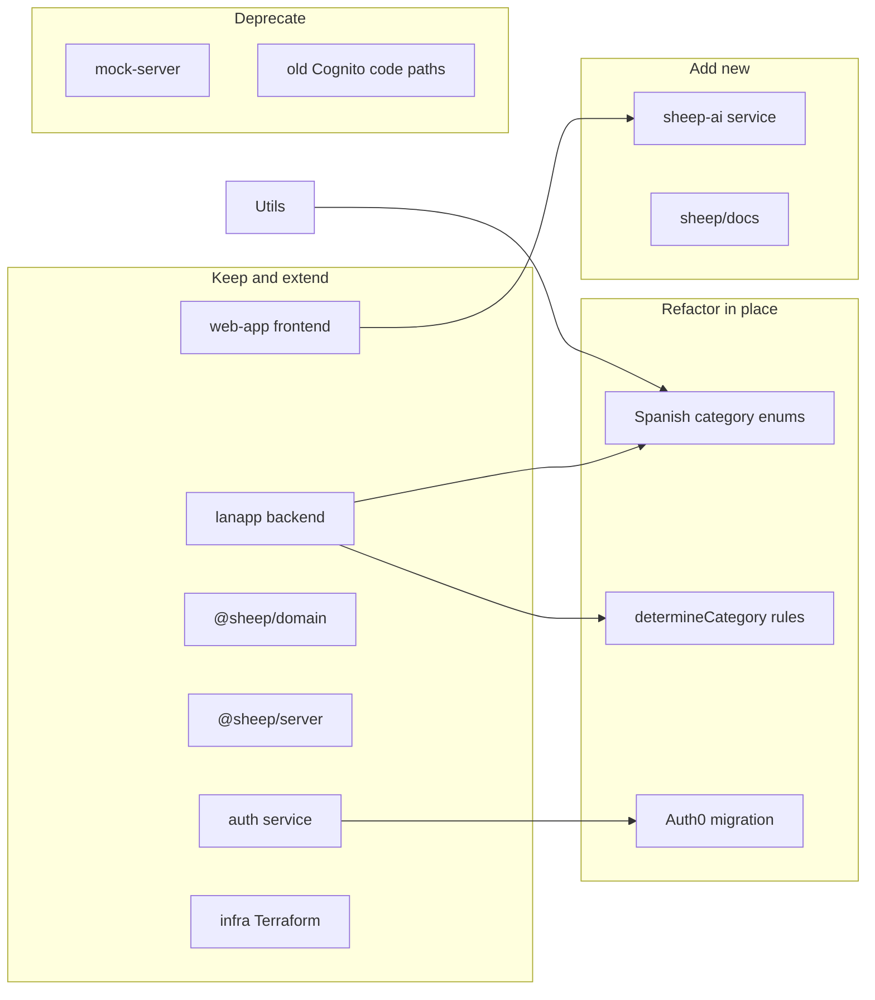
```mermaid
flowchart LR
    subgraph keep [Keep and extend]
        Lanapp[lanapp backend]
        WebApp[web-app frontend]
        Domain["@sheep/domain"]
        Server["@sheep/server"]
        Auth[auth service]
        Infra[infra Terraform]
    end

    subgraph refactor [Refactor in place]
        Categories[Spanish category enums]
        CategoryEngine[determineCategory rules]
        Auth0[Auth0 migration]
    end

    subgraph add [Add new]
        SheepAI[sheep-ai service]
        SheepDocs[sheep/docs]
    end

    subgraph drop [Deprecate]
        Mock[mock-server]
        Cognito[old Cognito code paths]
    end

    Lanapp --> Categories
    Lanapp --> CategoryEngine
    Auth --> Auth0
    WebApp --> SheepAI
    Utils --> Categories
```

### 2.2 Why not from scratch?

| Factor | Evolve monorepo | From scratch |
|--------|-----------------|--------------|
| **Domain model** | 8 entities + migration already exist | Rebuild all entities, FKs, enums |
| **Business rules** | Quarantine (7 d), mating side-effects exist | Re-implement from docs |
| **API pattern** | routes → services → repos proven | New conventions from zero |
| **Frontend shell** | Auth, layout, `DynamicTable`, Redux | Rebuild SPA scaffold |
| **Infra** | VPC, RDS, Cognito TF (adapt for Auth0/S3) | New Terraform |
| **Shared validation** | `@sheep/domain` Zod schemas | Single workspace package |
| **Time to first API** | Days | 4–6 weeks |
| **Risk** | Refactor category enums | Unknown unknowns in new codebase |

Greenfield only makes sense if the old code were unmaintainable or the wrong stack. It is **TypeScript + Express + React** — exactly what the plan needs.

### 2.3 What to reuse (keep as-is or lightly extend)

| Package | Reuse % | What is already good | Action |
|---------|---------|----------------------|--------|
| **`lanapp`** | ~70% | Sheep, weight, mating, pregnancy, medicine, location entities; layered architecture; Postman API; Docker/Makefile | Extend with health_check, breeding_cycle, category engine; fix route ordering |
| **`@sheep/domain`** | New | Spanish enums, Zod schemas, API contracts | **Done** — Spanish `SheepCategory` (Section 5); consumed by lanapp, web-app, sheep-ai |
| **`@sheep/server`** | New | Express middleware, response helpers | Used by lanapp and auth only |
| **`web-app`** | ~40% | Login UI, `DashboardLayout`, `DynamicTable`, Redux pattern, Tailwind, feature folders | Build sheep/health/reports/assistant features using `location` as template |
| **`auth`** | ~50% | Express service structure, token refresh flow in frontend | Migrate Cognito → Auth0 |
| **`infra/webapp/tf`** | ~80% | VPC, subnets, RDS, security groups | Add S3 bucket; optional Auth0 stays SaaS |
| **`sheep/docs`** | 100% | Excel/Word reference + this plan | Source of truth for business rules |

### 2.4 What to refactor (same package, intentional changes)

| Area | Current state | Target state |
|------|---------------|--------------|
| **Category enums** | English (`LAMB_MALE`, `PREGNANT_EWE`) | Spanish official names (Section 5): CORDERO, MALTONA, BORREGA PREÑADA, etc. |
| **`determineCategory()`** | Simplified age buckets (2.5 / 6 mo) | Official flow: 70 d weaning, 6 mo, 12 mo + ECO events |
| **Auth** | AWS Cognito | Auth0 (user preference) |
| **Sheep UI** | Nav links only | Full CRUD + detail + health + weight |
| **Reports** | Placeholder routes | Wired to lanapp `/reports/*` |
| **Tests** | Jest configured, no tests | Add for category engine + sale rules |

### 2.5 What to add new (does not exist yet)

| Package / module | Purpose |
|------------------|---------|
| **`sheep-ai`** | Bedrock agent + FAMACHA vision + pgvector RAG |
| **`lanapp` entities** | `health_check`, `breeding_cycle`, `weaning_record`, `sale_evaluation` |
| **`lanapp` routes** | `/health-check`, `/reports`, `/import`, `/upload`, `/breeding-cycle` |
| **`web-app` features** | `sheep`, `assistant`, `reports`, `import`, `planner` |
| **S3 + presigned uploads** | Photo storage for FAMACHA and sheep profiles |
| **Category cron job** | Nightly age-milestone transitions (UC-07) |

### 2.6 What to drop or ignore

| Item | Reason |
|------|--------|
| **`mock-server`** | Legacy settings mock; not needed |
| **Cognito code** | Replaced by Auth0 |
| **Greenfield repo** | No benefit vs evolve |
| **Firebase** | Not in stack (Auth0 + AWS sufficient) |

### 2.7 Target monorepo layout

```
repos/
├── webapp/                          # MONOREPO ROOT
│   ├── web-app/                     # React PWA — REUSE shell, BUILD sheep features
│   ├── lanapp/                      # Domain API — REUSE core, EXTEND entities
│   ├── auth/                        # Auth0 service — REFACTOR from Cognito
│   ├── sheep-ai/                    # NEW — Bedrock agent + vision
│   ├── packages/
│   │   ├── domain/                  # @sheep/domain — Spanish enums + Zod
│   │   └── server/                  # @sheep/server — Express middleware
│   ├── sheep/                       # NEW meta-package (docs only)
│   │   └── docs/                    # This plan + farm Excel/Word
│   └── awsp.code-workspace          # VS Code workspace
│
└── infra/
    └── webapp/tf/                   # REUSE VPC/RDS, ADD S3
```

### 2.8 Service boundaries in the monorepo

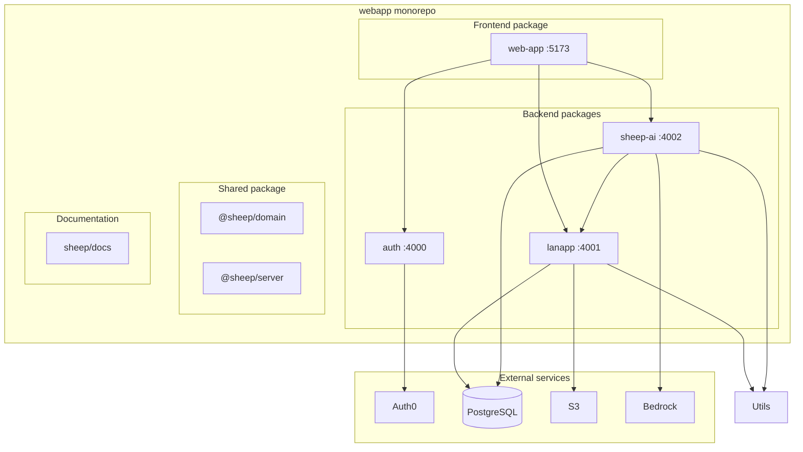
```mermaid
flowchart TB
    subgraph monorepo [webapp monorepo]
        subgraph fe [Frontend package]
            WebApp[web-app :5173]
        end
        subgraph be [Backend packages]
            Auth[auth :4000]
            Lanapp[lanapp :4001]
            SheepAI[sheep-ai :4002]
        end
        subgraph shared [Shared package]
            Domain["@sheep/domain"]
        Server["@sheep/server"]
        end
        subgraph docs [Documentation]
            SheepDocs[sheep/docs]
        end
    end

    subgraph external [External services]
        Auth0[Auth0]
        PG[(PostgreSQL)]
        S3[S3]
        Bedrock[Bedrock]
    end

    WebApp --> Auth
    WebApp --> Lanapp
    WebApp --> SheepAI
    Auth --> Auth0
    Lanapp --> Utils
    Lanapp --> PG
    Lanapp --> S3
    SheepAI --> Utils
    SheepAI --> Bedrock
    SheepAI --> PG
    SheepAI --> Lanapp
```

**Dependency rule:** `@sheep/domain` is imported by lanapp, web-app, and sheep-ai; `@sheep/server` by lanapp and auth only; **no circular deps**. `sheep-ai` calls `lanapp` over HTTP (tool pattern), not shared DB writes for domain logic.

### 2.9 Implementation order inside the monorepo

| Step | Package | Work |
|------|---------|------|
| 1 | `@sheep/domain` | Spanish `SheepCategory` enum + new schemas |
| 2 | `lanapp` | Migration, category engine, fix bugs |
| 3 | `auth` + `web-app` | Auth0 end-to-end |
| 4 | `lanapp` | S3 upload, health_check, reports, import |
| 5 | `web-app` | Sheep UI (copy `location` pattern) |
| 6 | `sheep-ai` | Agent + vision |
| 7 | `web-app` | Assistant chat, reports, import wizard |
| 8 | `infra` | S3 bucket, deploy |

### 2.10 Effort comparison (same MVP scope)

| Work item | Evolve monorepo | From scratch |
|-----------|-----------------|--------------|
| Domain API + DB | 2–3 weeks (extend) | 5 weeks |
| Category engine (Section 5) | 1–2 weeks | 1–2 weeks |
| Frontend shell + auth | 1 week (exists) | 3 weeks |
| Sheep + health UI | 3 weeks | 3 weeks |
| sheep-ai | 2 weeks | 2 weeks |
| Import + reports | 2 weeks | 2 weeks |
| Infra + deploy | 1–2 weeks | 3 weeks |
| **Total** | **13–15 weeks** | **23–25 weeks** |

---

## 3. Actors and roles

| Actor | Description | Permissions |
|-------|-------------|-------------|
| **Admin** | System owner, user management | Full access |
| **Farm manager** (`farm_manager`) | Oversees inventory, reports, sale decisions | CRUD all data, run reports, AI agent |
| **Field worker** (`field_worker`) | Weighing, FAMACHA, photos in the field | Record weights, health checks, view assigned flock |
| **AI agent** (system) | Read-only tool caller | Queries lanapp APIs; never writes without user action |

---

## 4. Use case catalog

### 4.1 Core inventory

| ID | Use case | Trigger | Outcome |
|----|----------|---------|---------|
| UC-01 | Register birth | Lamb born on farm | Sheep record created; 7-day quarantine started |
| UC-02 | Assign tag and name | Day 7+ after birth | Tag assigned; males = number only, females = name + number |
| UC-03 | Register purchase | Sheep bought externally | Record with quarantine; males/females separated |
| UC-04 | View inventory | Manager opens list | Filter by farm, sex, category, status |
| UC-05 | Update sheep disposition | Manager decision | Category → **VENTA** or **FAENADO/A** |
| UC-06 | Import legacy Excel | One-time migration | Preview → validate → bulk insert |
| UC-07 | Auto category transition | Age milestone, ECO, birth, weaning | System updates category per official flow |

### 4.2 Weight and growth

| ID | Use case | Trigger | Outcome |
|----|----------|---------|---------|
| UC-10 | Record weight | Periodic weigh-in | Weight history + auto daily gain (g/day) |
| UC-11 | Weaning check | Sheep ≥ **70 days** (official) | Category → MALTÓN / MALTONA; weaning record created |
| UC-12 | Semiannual review | Jan–Jun or Jul–Dec batch | Flag below-average animals for sale |

### 4.3 Health (FAMACHA)

| ID | Use case | Trigger | Outcome |
|----|----------|---------|---------|
| UC-20 | Monthly FAMACHA round | Scheduled farm check | Score 1–5 per animal per farm |
| UC-21 | AI-assisted FAMACHA | Photo of inner eyelid | AI suggests score; **human confirms** |
| UC-22 | Treatment log | Score ≥ 3 or schedule | Deworm / vaccinate / Vitasel recorded |
| UC-23 | Health alert | Score ≥ 3 or overdue check | Dashboard + notification |

### 4.4 Breeding

| ID | Use case | Trigger | Outcome |
|----|----------|---------|---------|
| UC-30 | Record mating | Ewe in heat (~15-day cycle) | Mating linked to ram and cycle |
| UC-31 | Pregnancy diagnosis (ECO) | ~30 days post-mating | Pregnant / Empty / Recheck via **ECO** or **FAMACHA** (manual) |
| UC-32 | Re-mate empty ewe | ECO = empty | Vitasel + second ram |
| UC-33 | Record delivery | Birth occurs | Lambs linked; ewe → **OVEJA LACTANCIA** |
| UC-34 | AI insemination program | Embryo transfer schedule | Hormone protocol tracked (Phase 5) |

### 4.5 Sales and economics

| ID | Use case | Trigger | Outcome |
|----|----------|---------|---------|
| UC-40 | Evaluate sale eligibility | Semiannual review | Rules from Word doc applied |
| UC-41 | Slaughter record | Animal faenado | Yield %, price, revenue (Phase 5) |
| UC-42 | Feed consumption | Daily farm ops | Feed type, qty, cost (Phase 5) |

### 4.6 AI and reporting

| ID | Use case | Trigger | Outcome |
|----|----------|---------|---------|
| UC-50 | Ask farm question | Chat message | Agent queries live data, answers in Spanish |
| UC-51 | Generate report | User or agent request | Maltonas / preñadas / montas / FAMACHA JSON → UI table |
| UC-52 | Summarize farm health | Manager request | Aggregate FAMACHA + treatments + alerts |

### 4.7 Sale eligibility rules (from Word doc)

| Rule | Logic |
|------|-------|
| Below-average birth weight | Flag for sale if weight < herd average at birth |
| Single vs twin | Twins preferred to **keep**; singles more likely **sale** |
| Second birth single | Ewe whose 2nd birth is single → flagged for sale |
| Weaning threshold | Below weaning weight target → sale candidate |
| Review periods | Two batches per year: Jan–Jun, Jul–Dec |

### 4.8 Disposition rules (from status flow image)

| Category | Sex | When applicable |
|----------|-----|-----------------|
| **VENTA** | MACHO / HEMBRA | Any prior category — animal selected for sale |
| **FAENADA** | HEMBRA | From weaning onward, any category |
| **FAENADO** | MACHO | From weaning up to 12 months of age |

---

## 5. Official category & status flow (canonical)

Source: [`PHOTO-2022-09-07-20-59-29 2.jpg`](./PHOTO-2022-09-07-20-59-29%202.jpg) — this is the **authoritative classification** the system must implement. Categories are driven by **sex**, **age**, and **reproductive events** (ECO, birth, weaning).

> **Note:** Word doc / Excel sheets sometimes say weaning at **75 days**. The status flow image says **70 days**. The system should use **70 days** as default and allow farm config override.

### 5.1 Full classification table

| Sexo | Categoría | Observaciones (trigger) |
|------|-----------|-------------------------|
| MACHO | **CORDERO** | 0 days → weaning (~70 days) |
| HEMBRA | **CORDERA** | 0 days → weaning (~70 days) |
| MACHO | **CORDERO DESTETADO (MALTÓN)** | Weaning → 6 months |
| HEMBRA | **CORDERA DESTETADA (MALTONA)** | Weaning → 6 months |
| MACHO | **BORREGO** | 6 → 12 months |
| HEMBRA | **BORREGA** | 6 → 12 months |
| HEMBRA | **BORREGA PREÑADA** | ECO confirms pregnancy → birth |
| MACHO | **REPRODUCTOR** | ≥ 12 months, selected breeding males |
| HEMBRA | **OVEJA PREÑADA** | ECO confirms pregnancy → birth |
| HEMBRA | **OVEJA LACTANCIA** | Birth → weaning of offspring (~70 days) |
| HEMBRA | **OVEJA VACÍA** | Offspring weaned → next ECO pregnancy |
| MACHO / HEMBRA | **VENTA** | Any category — sale |
| HEMBRA | **FAENADA** | From weaning, any category |
| MACHO | **FAENADO** | Weaning → 12 months |

### 5.2 Female category state machine

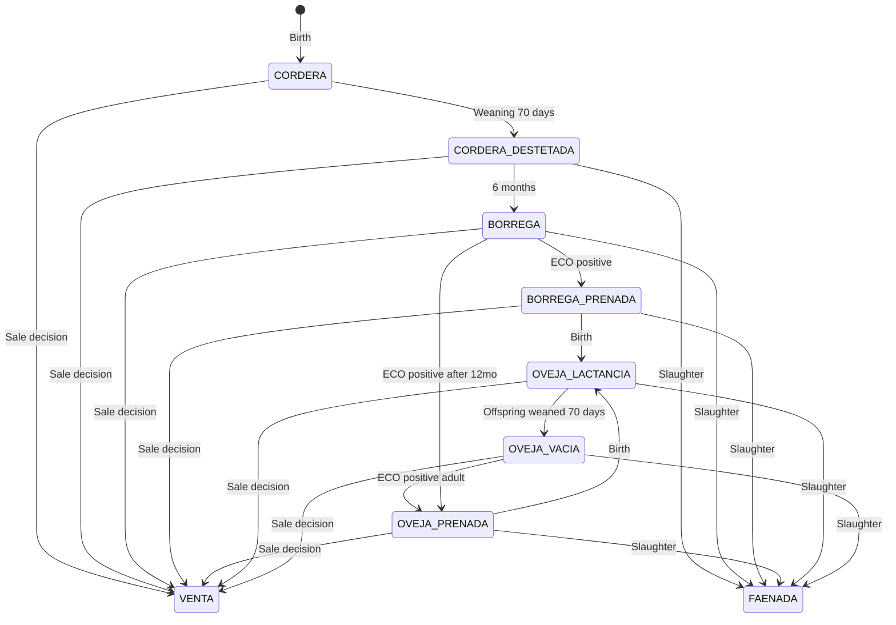
```mermaid
stateDiagram-v2
    [*] --> CORDERA: Birth
    CORDERA --> CORDERA_DESTETADA: Weaning 70 days
    CORDERA_DESTETADA --> BORREGA: 6 months
    BORREGA --> BORREGA_PRENADA: ECO positive
    BORREGA_PRENADA --> OVEJA_LACTANCIA: Birth
    OVEJA_LACTANCIA --> OVEJA_VACIA: Offspring weaned 70 days
    OVEJA_VACIA --> OVEJA_PRENADA: ECO positive adult
    BORREGA --> OVEJA_PRENADA: ECO positive after 12mo
    OVEJA_PRENADA --> OVEJA_LACTANCIA: Birth

    CORDERA --> VENTA: Sale decision
    CORDERA_DESTETADA --> VENTA: Sale decision
    BORREGA --> VENTA: Sale decision
    BORREGA_PRENADA --> VENTA: Sale decision
    OVEJA_PRENADA --> VENTA: Sale decision
    OVEJA_LACTANCIA --> VENTA: Sale decision
    OVEJA_VACIA --> VENTA: Sale decision

    CORDERA_DESTETADA --> FAENADA: Slaughter
    BORREGA --> FAENADA: Slaughter
    BORREGA_PRENADA --> FAENADA: Slaughter
    OVEJA_PRENADA --> FAENADA: Slaughter
    OVEJA_LACTANCIA --> FAENADA: Slaughter
    OVEJA_VACIA --> FAENADA: Slaughter
```

### 5.3 Male category state machine

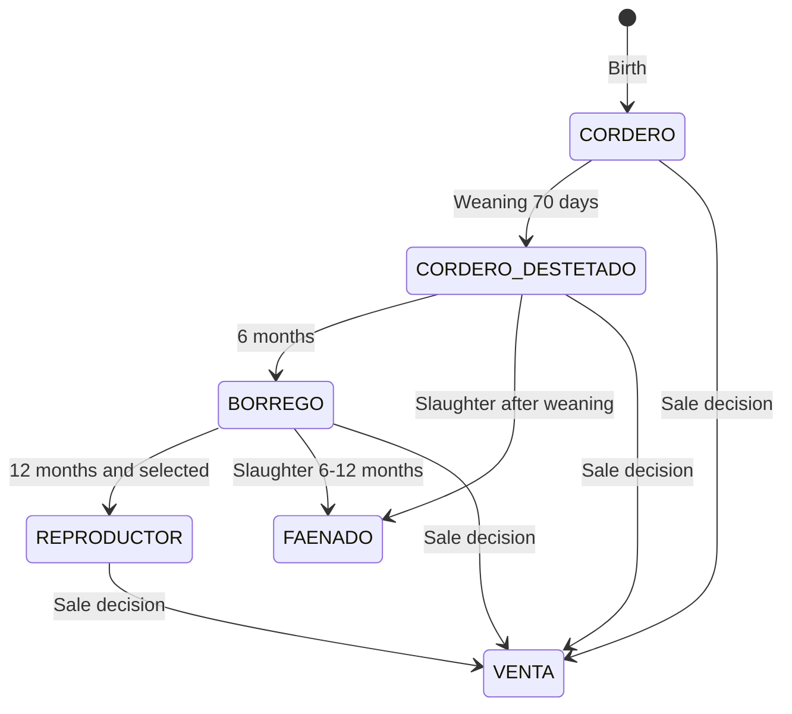
```mermaid
stateDiagram-v2
    [*] --> CORDERO: Birth
    CORDERO --> CORDERO_DESTETADO: Weaning 70 days
    CORDERO_DESTETADO --> BORREGO: 6 months
    BORREGO --> REPRODUCTOR: 12 months and selected
    BORREGO --> FAENADO: Slaughter 6-12 months
    CORDERO_DESTETADO --> FAENADO: Slaughter after weaning

    CORDERO --> VENTA: Sale decision
    CORDERO_DESTETADO --> VENTA: Sale decision
    BORREGO --> VENTA: Sale decision
    REPRODUCTOR --> VENTA: Sale decision
```

### 5.4 Age-based transitions (automatic)

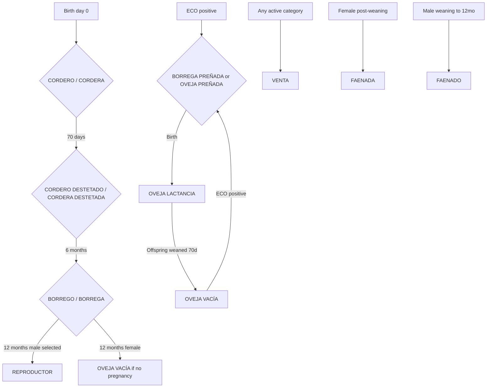
```mermaid
flowchart TD
    Birth[Birth day 0] --> Cordero{CORDERO / CORDERA}
    Cordero -->|70 days| Destete{CORDERO DESTETADO / CORDERA DESTETADA}
    Destete -->|6 months| Borrego{BORREGO / BORREGA}
    Borrego -->|12 months male selected| Reproductor[REPRODUCTOR]
    Borrego -->|12 months female| AdultEwe[OVEJA VACÍA if no pregnancy]

    EcoPositive[ECO positive] --> Pregnant{BORREGA PREÑADA or OVEJA PREÑADA}
    Pregnant -->|Birth| Lactancia[OVEJA LACTANCIA]
    Lactancia -->|Offspring weaned 70d| Vacia[OVEJA VACÍA]
    Vacia -->|ECO positive| Pregnant

    AnyCategory[Any active category] --> Venta[VENTA]
    PostWeaningFemale[Female post-weaning] --> Faenada[FAENADA]
    MaleWeaningTo12[Male weaning to 12mo] --> Faenado[FAENADO]
```

### 5.5 Event-driven transitions

| Event | System action | Category change |
|-------|---------------|-----------------|
| `birth` | Create lamb record | → CORDERO / CORDERA |
| `weaning_record` (70 d) | Record weaning weight | → MALTÓN / MALTONA |
| `age_milestone` (6 mo) | Nightly job | → BORREGO / BORREGA |
| `age_milestone` (12 mo) | Nightly job + selection flag | Male → REPRODUCTOR if selected |
| `pregnancy_check.isPregnant` | ECO result | → BORREGA PREÑADA or OVEJA PREÑADA |
| `delivery` | Birth of offspring | Ewe → OVEJA LACTANCIA |
| `offspring_weaned` | Last lamb weaned | Ewe → OVEJA VACÍA |
| `disposition_sale` | Manager marks sale | → VENTA (status SOLD) |
| `disposition_slaughter` | Slaughter recorded | → FAENADO / FAENADA |

### 5.6 Map to current code (`@sheep/domain` enums)

Spanish enums live in [`packages/domain/src/enums/sheep-category.ts`](../../packages/domain/src/enums/sheep-category.ts). Category rules are in [`lanapp/src/domain/category.engine.ts`](../../lanapp/src/domain/category.engine.ts). Migration from old English enums:

| Official (Spanish) | Current enum | Action |
|--------------------|--------------|--------|
| CORDERO | `LAMB_MALE` | Rename / add alias |
| CORDERA | `LAMB_FEMALE` | Rename / add alias |
| CORDERO DESTETADO (MALTÓN) | `WEANED_LAMB_MALE` | Rename |
| CORDERA DESTETADA (MALTONA) | `WEANED_LAMB_FEMALE` | Rename |
| BORREGO | `RAM` (wrong) | **New** `BORREGO` |
| BORREGA | `EWE` (wrong) | **New** `BORREGA` |
| BORREGA PREÑADA | — | **New** |
| REPRODUCTOR | `BREEDING_RAM` | Align |
| OVEJA PREÑADA | `PREGNANT_EWE` | Align |
| OVEJA LACTANCIA | `LACTATING_EWE` | Align |
| OVEJA VACÍA | `EMPTY_EWE` | Align |
| VENTA | `MALE_SALE` / `FEMALE_SALE` | Unify → `VENTA` |
| FAENADO / FAENADA | `MALE_SLAUGHTER` / `FEMALE_SLAUGHTER` | Unify |

**`determineCategory()` in `lanapp/src/utils/utils.ts`** must be rewritten to follow Section 5 rules (age thresholds 70 d / 6 mo / 12 mo + reproductive state), not the current simplified 2.5 / 6 month logic.

### 5.7 Reports tied to categories

| Report | Category filter |
|--------|-----------------|
| **Maltonas** | `CORDERA DESTETADA (MALTONA)` — females weaning → 6 months |
| **Preñadas** | `BORREGA PREÑADA` + `OVEJA PREÑADA` |
| **Montas** | Ewes in `OVEJA VACÍA` or `BORREGA` in active breeding cycle |
| **Reproductores** | `REPRODUCTOR` males (new report) |

---

## 6. Business lifecycle (manual → automated)

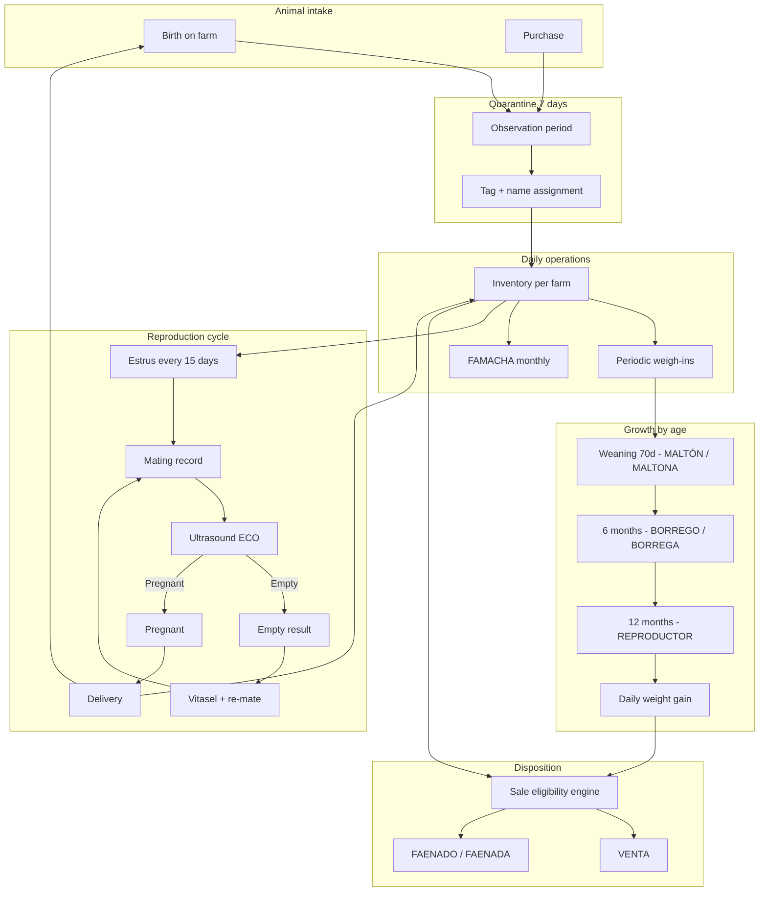
```mermaid
flowchart TD
    subgraph intake [Animal intake]
        Birth[Birth on farm]
        Purchase[Purchase]
    end

    subgraph quarantine [Quarantine 7 days]
        QWatch[Observation period]
        QTag[Tag + name assignment]
    end

    subgraph daily [Daily operations]
        Inventory[Inventory per farm]
        Weight[Periodic weigh-ins]
        Famacha[FAMACHA monthly]
    end

    subgraph reproduction [Reproduction cycle]
        Heat[Estrus every 15 days]
        Mating[Mating record]
        Eco[Ultrasound ECO]
        Empty[Empty result]
        Vitasel[Vitasel + re-mate]
        Pregnant[Pregnant]
        Delivery[Delivery]
    end

    subgraph growth [Growth by age]
        Weaning[Weaning 70d - MALTÓN / MALTONA]
        SixMo[6 months - BORREGO / BORREGA]
        TwelveMo[12 months - REPRODUCTOR]
        Gain[Daily weight gain]
    end

    subgraph disposition [Disposition]
        Venta[VENTA]
        Faenado[FAENADO / FAENADA]
        SaleEval[Sale eligibility engine]
    end

    Birth --> QWatch
    Purchase --> QWatch
    QWatch --> QTag
    QTag --> Inventory
    Inventory --> Weight
    Inventory --> Famacha
    Inventory --> Heat
    Heat --> Mating
    Mating --> Eco
    Eco -->|Empty| Empty
    Empty --> Vitasel
    Vitasel --> Mating
    Eco -->|Pregnant| Pregnant
    Pregnant --> Delivery
    Delivery --> Birth
    Delivery --> Inventory
    Weight --> Weaning
    Weaning --> SixMo
    SixMo --> TwelveMo
    TwelveMo --> Gain
    Inventory --> SaleEval
    Gain --> SaleEval
    SaleEval --> Venta
    SaleEval --> Faenado
```

---

## 7. System architecture

### 7.1 High-level component diagram

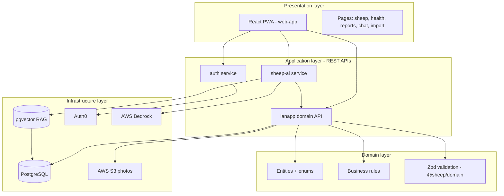
```mermaid
flowchart TB
    subgraph client [Presentation layer]
        PWA[React PWA - web-app]
        Pages[Pages: sheep, health, reports, chat, import]
    end

    subgraph api [Application layer - REST APIs]
        AuthAPI[auth service]
        LanappAPI[lanapp domain API]
        AIAPI[sheep-ai service]
    end

    subgraph domain [Domain layer]
        Entities[Entities + enums]
        Rules[Business rules]
        Schemas[Zod validation - @sheep/domain]
    end

    subgraph infra [Infrastructure layer]
        PG[(PostgreSQL)]
        Vector[(pgvector RAG)]
        S3[AWS S3 photos]
        Auth0[Auth0]
        Bedrock[AWS Bedrock]
    end

    PWA --> AuthAPI
    PWA --> LanappAPI
    PWA --> AIAPI
    AuthAPI --> Auth0
    LanappAPI --> Entities
    LanappAPI --> Rules
    LanappAPI --> Schemas
    LanappAPI --> PG
    LanappAPI --> S3
    AIAPI --> Bedrock
    AIAPI --> Vector
    AIAPI --> LanappAPI
    Vector --> PG
```

### 7.2 Clean architecture layers

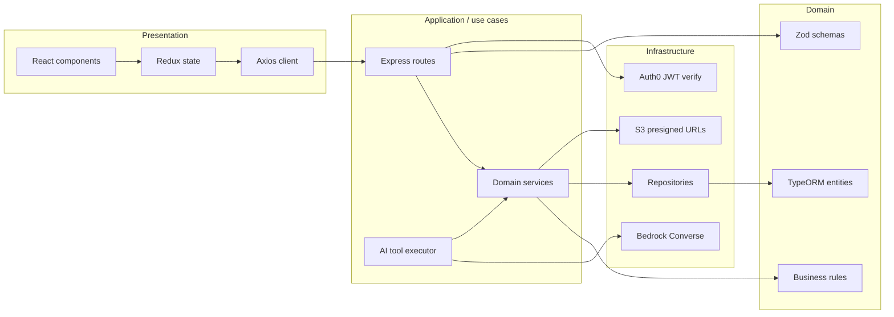
```mermaid
flowchart LR
    subgraph presentation [Presentation]
        UI[React components]
        Redux[Redux state]
        APIClient[Axios client]
    end

    subgraph application [Application / use cases]
        Routes[Express routes]
        Services[Domain services]
        AgentTools[AI tool executor]
    end

    subgraph domain [Domain]
        Entity[TypeORM entities]
        Utils[Business rules]
        Validation[Zod schemas]
    end

    subgraph infrastructure [Infrastructure]
        Repo[Repositories]
        S3Client[S3 presigned URLs]
        BedrockClient[Bedrock Converse]
        JWT[Auth0 JWT verify]
    end

    UI --> Redux --> APIClient --> Routes --> Services
    Services --> Utils
    Services --> Repo --> Entity
    Routes --> Validation
    AgentTools --> BedrockClient
    AgentTools --> Services
    Routes --> JWT
    Services --> S3Client
```

### 7.3 Deployment architecture (AWS)

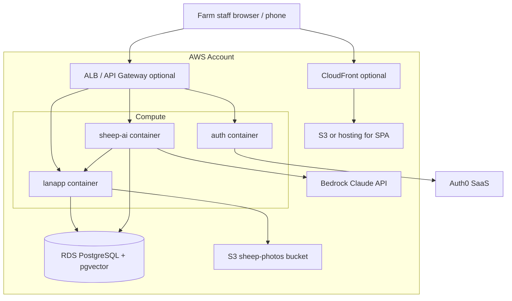
```mermaid
flowchart TB
    User[Farm staff browser / phone]

    subgraph aws [AWS Account]
        CF[CloudFront optional]
        S3Web[S3 or hosting for SPA]
        ALB[ALB / API Gateway optional]

        subgraph compute [Compute]
            AuthSvc[auth container]
            LanappSvc[lanapp container]
            AISvc[sheep-ai container]
        end

        RDS[(RDS PostgreSQL + pgvector)]
        S3Photos[S3 sheep-photos bucket]
        Bedrock[Bedrock Claude API]
    end

    Auth0Cloud[Auth0 SaaS]

    User --> CF --> S3Web
    User --> ALB
    ALB --> AuthSvc
    ALB --> LanappSvc
    ALB --> AISvc
    AuthSvc --> Auth0Cloud
    LanappSvc --> RDS
    LanappSvc --> S3Photos
    AISvc --> Bedrock
    AISvc --> RDS
    AISvc --> LanappSvc
```

### 7.4 Data model (core entities)

```mermaid
erDiagram
    LOCATION ||--o{ SHEEP : "birth / current"
    SHEEP ||--o{ WEIGHT : has
    SHEEP ||--o{ HEALTH_CHECK : has
    SHEEP ||--o{ MEDICINE_APPLICATION : receives
    SHEEP ||--o{ WEANING_RECORD : has
    SHEEP ||--o{ SALE_EVALUATION : evaluated
    SHEEP ||--o| SHEEP : mother
    SHEEP ||--o| SHEEP : father
    SHEEP ||--o{ MATING : "male / female"
    MATING ||--o{ PREGNANCY_CHECK : has
    SHEEP ||--o{ BREEDING_CYCLE : ewe
    SHEEP ||--o{ BREEDING_CYCLE : ram

    SHEEP {
        uuid id
        string tag
        string name
        enum breed gender category status
        date birthDate
        decimal weight
        boolean isPregnant
        string imageUrl
    }

    HEALTH_CHECK {
        uuid id
        int famachaScore
        int aiSuggestedScore
        string imageUrl
        string confirmedBy
    }

    WEIGHT {
        uuid id
        decimal weight
        decimal dailyGain
        date measurementDate
    }

    BREEDING_CYCLE {
        string cycleName
        date matingDate
        enum diagnosisType result
        boolean vitaselApplied
    }
```

---

## 8. Technology stack

### 8.1 What we will use

| Layer | Technology | Version / notes | Cost |
|-------|------------|-----------------|------|
| **Frontend** | React + Vite + TypeScript | Existing in `web-app` | Free |
| **UI** | Tailwind CSS 4 + Headless UI | Existing | Free |
| **State** | Redux Toolkit | Existing | Free |
| **Forms** | react-hook-form + Zod | Existing | Free |
| **Mobile** | PWA + `input[capture]` camera | No native app needed | Free |
| **Auth** | Auth0 | Free tier ~7k MAU | Free → paid |
| **API** | Node.js + Express + TypeScript | 3 microservices | Free |
| **ORM** | TypeORM | Existing in lanapp | Free |
| **Database** | PostgreSQL 15 on AWS RDS | Existing Terraform | ~$15–30/mo |
| **Vectors** | pgvector extension | Agent RAG | Free |
| **Image storage** | AWS S3 presigned uploads | 5 GB free tier | ~$1/mo |
| **AI chat + vision** | AWS Bedrock — Claude 3.5 Sonnet | us-east-1 | ~$5–20/mo low usage |
| **IaC** | Terraform | `infra/webapp/tf` | Free |
| **CI/CD** | GitHub Actions (optional) | — | Free |
| **Shared lib** | `@sheep/domain` + `@sheep/server` | npm workspaces | Free |

### 8.2 What we will NOT use

| Option | Reason |
|--------|--------|
| Firebase | Auth0 + S3 + Bedrock keeps stack simpler (2 vendors) |
| Cognito | Replaced by Auth0 per project decision |
| Native mobile app | PWA + camera is enough for field FAMACHA |
| Separate vector DB | pgvector on existing Postgres is sufficient |

### 8.3 Service ports (local dev)

| Service | Port | Base path |
|---------|------|-----------|
| auth | 4000 | `/api/v1/g/auth` |
| lanapp | 4001 | `/api/v1/lanapp` |
| sheep-ai | 4002 | `/api/v1/ai` |
| web-app | 5173 | `/` |

---

## 9. Flow diagrams — all cases

### 9.1 Authentication flow

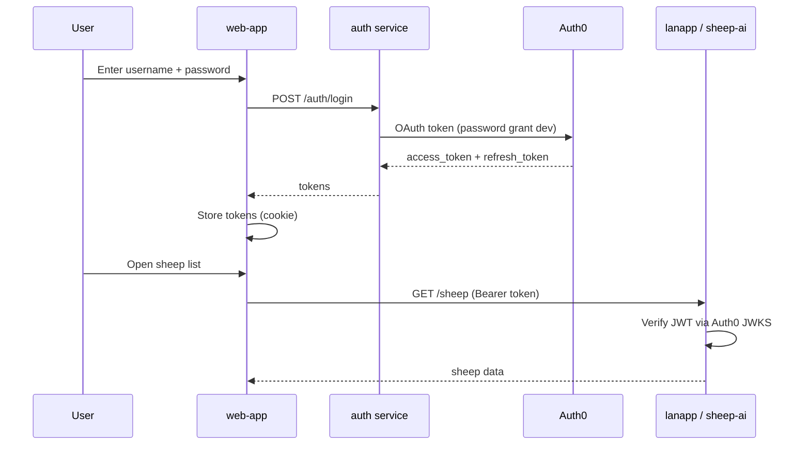
```mermaid
sequenceDiagram
    participant User
    participant SPA as web-app
    participant Auth as auth service
    participant Auth0
    participant API as lanapp / sheep-ai

    User->>SPA: Enter username + password
    SPA->>Auth: POST /auth/login
    Auth->>Auth0: OAuth token (password grant dev)
    Auth0-->>Auth: access_token + refresh_token
    Auth-->>SPA: tokens
    SPA->>SPA: Store tokens (cookie)

    User->>SPA: Open sheep list
    SPA->>API: GET /sheep (Bearer token)
    API->>API: Verify JWT via Auth0 JWKS
    API-->>SPA: sheep data
```

### 9.2 UC-01 — Birth registration

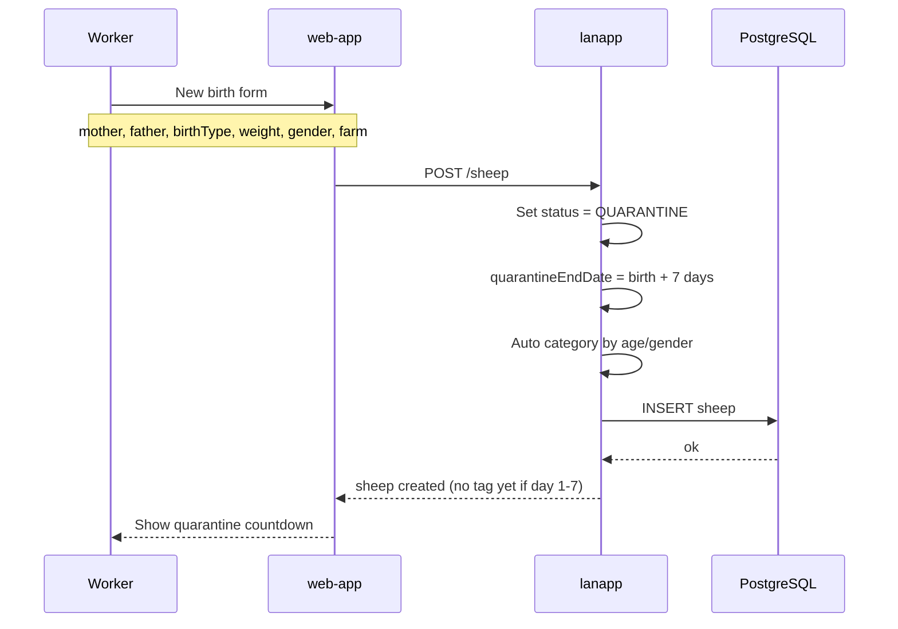
```mermaid
sequenceDiagram
    participant Worker
    participant UI as web-app
    participant API as lanapp
    participant DB as PostgreSQL

    Worker->>UI: New birth form
    Note over Worker,UI: mother, father, birthType, weight, gender, farm
    UI->>API: POST /sheep
    API->>API: Set status = QUARANTINE
    API->>API: quarantineEndDate = birth + 7 days
    API->>API: Auto category by age/gender
    API->>DB: INSERT sheep
    DB-->>API: ok
    API-->>UI: sheep created (no tag yet if day 1-7)
    UI-->>Worker: Show quarantine countdown
```

### 9.3 UC-02 — Tag and name after quarantine

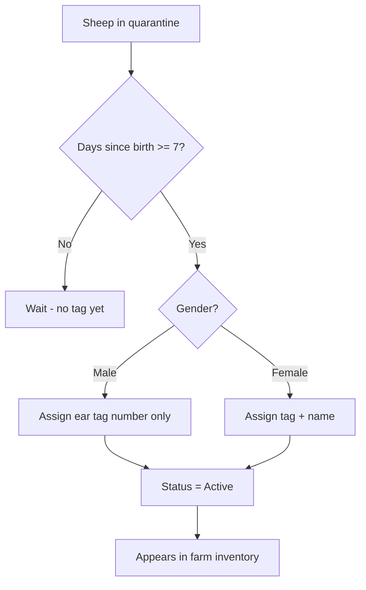
```mermaid
flowchart TD
    Start[Sheep in quarantine] --> CheckDays{Days since birth >= 7?}
    CheckDays -->|No| Wait[Wait - no tag yet]
    CheckDays -->|Yes| GenderCheck{Gender?}
    GenderCheck -->|Male| TagOnly[Assign ear tag number only]
    GenderCheck -->|Female| TagAndName[Assign tag + name]
    TagOnly --> Active[Status = Active]
    TagAndName --> Active
    Active --> Inventory[Appears in farm inventory]
```

### 9.4 UC-03 — Purchase intake

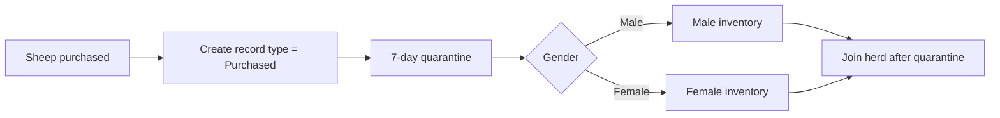
```mermaid
flowchart LR
    Purchase[Sheep purchased] --> Record[Create record type = Purchased]
    Record --> Quarantine[7-day quarantine]
    Quarantine --> SepInventory{Gender}
    SepInventory -->|Male| MaleInv[Male inventory]
    SepInventory -->|Female| FemaleInv[Female inventory]
    MaleInv --> ActiveHerd[Join herd after quarantine]
    FemaleInv --> ActiveHerd
```

### 9.5 UC-10 — Weight recording with daily gain

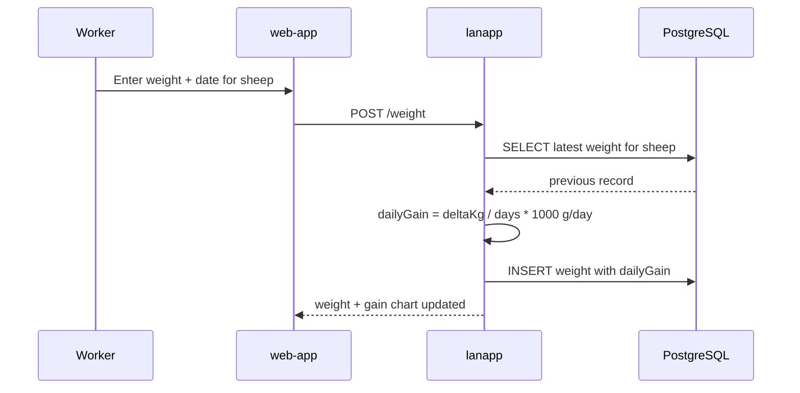
```mermaid
sequenceDiagram
    participant Worker
    participant UI as web-app
    participant API as lanapp
    participant DB as PostgreSQL

    Worker->>UI: Enter weight + date for sheep
    UI->>API: POST /weight
    API->>DB: SELECT latest weight for sheep
    DB-->>API: previous record
    API->>API: dailyGain = deltaKg / days * 1000 g/day
    API->>DB: INSERT weight with dailyGain
    API-->>UI: weight + gain chart updated
```

### 9.6 UC-11 — Weaning alert (70 days)

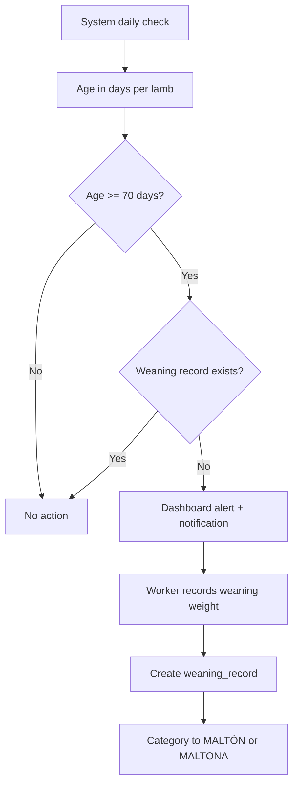
```mermaid
flowchart TD
    Cron[System daily check] --> AgeCalc[Age in days per lamb]
    AgeCalc --> Threshold{Age >= 70 days?}
    Threshold -->|No| Skip[No action]
    Threshold -->|Yes| HasWeaning{Weaning record exists?}
    HasWeaning -->|No| Alert[Dashboard alert + notification]
    HasWeaning -->|Yes| Skip
    Alert --> Worker[Worker records weaning weight]
    Worker --> Record[Create weaning_record]
    Record --> Category[Category to MALTÓN or MALTONA]
```

### 9.7 UC-21 — FAMACHA with AI vision (full flow)

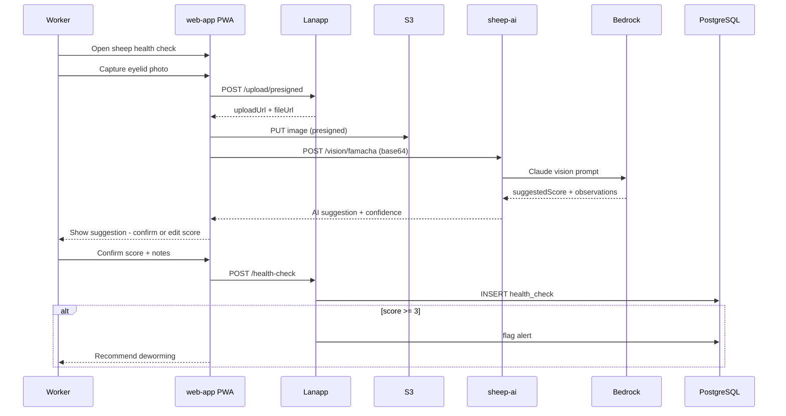
```mermaid
sequenceDiagram
    participant Worker
    participant UI as web-app PWA
    participant Lanapp
    participant S3
    participant AI as sheep-ai
    participant Bedrock
    participant DB as PostgreSQL

    Worker->>UI: Open sheep health check
    Worker->>UI: Capture eyelid photo
    UI->>Lanapp: POST /upload/presigned
    Lanapp-->>UI: uploadUrl + fileUrl
    UI->>S3: PUT image (presigned)
    UI->>AI: POST /vision/famacha (base64)
    AI->>Bedrock: Claude vision prompt
    Bedrock-->>AI: suggestedScore + observations
    AI-->>UI: AI suggestion + confidence
    UI-->>Worker: Show suggestion - confirm or edit score
    Worker->>UI: Confirm score + notes
    UI->>Lanapp: POST /health-check
    Lanapp->>DB: INSERT health_check
    alt score >= 3
        Lanapp->>DB: flag alert
        UI-->>Worker: Recommend deworming
    end
```

### 9.8 UC-30–33 — Breeding cycle (montas → ECO → birth)

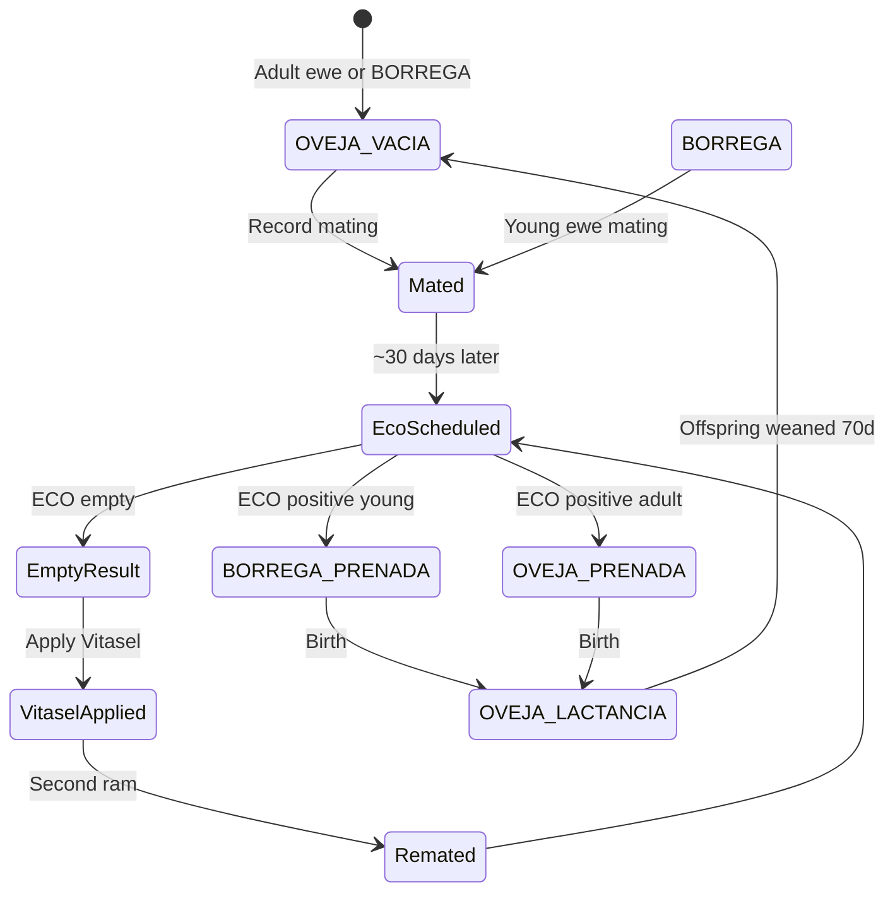
```mermaid
stateDiagram-v2
    [*] --> OVEJA_VACIA: Adult ewe or BORREGA
    OVEJA_VACIA --> Mated: Record mating
    BORREGA --> Mated: Young ewe mating
    Mated --> EcoScheduled: ~30 days later
    EcoScheduled --> BORREGA_PRENADA: ECO positive young
    EcoScheduled --> OVEJA_PRENADA: ECO positive adult
    EcoScheduled --> EmptyResult: ECO empty
    EmptyResult --> VitaselApplied: Apply Vitasel
    VitaselApplied --> Remated: Second ram
    Remated --> EcoScheduled
    BORREGA_PRENADA --> OVEJA_LACTANCIA: Birth
    OVEJA_PRENADA --> OVEJA_LACTANCIA: Birth
    OVEJA_LACTANCIA --> OVEJA_VACIA: Offspring weaned 70d
```

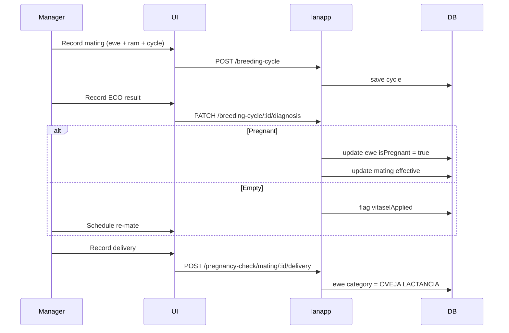
```mermaid
sequenceDiagram
    participant Manager
    participant UI
    participant API as lanapp
    participant DB

    Manager->>UI: Record mating (ewe + ram + cycle)
    UI->>API: POST /breeding-cycle
    API->>DB: save cycle

    Manager->>UI: Record ECO result
    UI->>API: PATCH /breeding-cycle/:id/diagnosis
    alt Pregnant
        API->>DB: update ewe isPregnant = true
        API->>DB: update mating effective
    else Empty
        API->>DB: flag vitaselApplied
        Manager->>UI: Schedule re-mate
    end

    Manager->>UI: Record delivery
    UI->>API: POST /pregnancy-check/mating/:id/delivery
    API->>DB: ewe category = OVEJA LACTANCIA
```

### 9.9 UC-07 — Automatic category transition

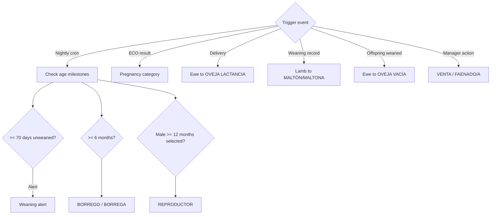
```mermaid
flowchart TD
    Trigger{Trigger event}
    Trigger -->|Nightly cron| AgeJob[Check age milestones]
    Trigger -->|ECO result| EcoJob[Pregnancy category]
    Trigger -->|Delivery| BirthJob[Ewe to OVEJA LACTANCIA]
    Trigger -->|Weaning record| WeanJob[Lamb to MALTÓN/MALTONA]
    Trigger -->|Offspring weaned| EweJob[Ewe to OVEJA VACÍA]
    Trigger -->|Manager action| DispoJob[VENTA / FAENADO/A]

    AgeJob --> D70{>= 70 days unweaned?}
    D70 -->|Alert| WeanAlert[Weaning alert]
    AgeJob --> M6{>= 6 months?}
    M6 --> Borrego[BORREGO / BORREGA]
    AgeJob --> M12{Male >= 12 months selected?}
    M12 --> Reproductor[REPRODUCTOR]
```

### 9.10 UC-40 — Sale eligibility evaluation

```mermaid
flowchart TD
    Start[Semiannual batch Jan-Jun or Jul-Dec] --> Load[Load lambs under 180 days]
    Load --> AvgCalc[Calculate average birth weight]
    AvgCalc --> Loop[For each animal]
    Loop --> BelowAvg{Weight below average?}
    BelowAvg -->|Yes| Eligible1[Eligible - reason: low birth weight]
    BelowAvg -->|No| BirthType{Twin or single?}
    BirthType -->|Single| Eligible2[Eligible - reason: single birth]
    BirthType -->|Twin| Keep[Keep - preferred twin]
    Loop --> SecondBirth{Ewe 2nd birth single?}
    SecondBirth -->|Yes| Eligible3[Eligible - ewe flag]
    Eligible1 --> Save[Save sale_evaluation]
    Eligible2 --> Save
    Eligible3 --> Save
    Keep --> Save
```

### 9.11 UC-50 — AI agent chat

```mermaid
sequenceDiagram
    participant User
    participant ChatUI
    participant AI as sheep-ai
    participant RAG as pgvector
    participant Bedrock
    participant Lanapp
    participant DB

    User->>ChatUI: Natural language question
    ChatUI->>AI: POST /chat + history
    AI->>RAG: Search relevant farm context
    RAG-->>AI: prior Q&A + records
    AI->>Bedrock: System prompt + tools + message
    Bedrock-->>AI: tool_use: generate_report(prenadas)
    AI->>Lanapp: GET /reports/prenadas
    Lanapp->>DB: query
    DB-->>Lanapp: 12 ewes
    Lanapp-->>AI: report JSON
    AI->>Bedrock: tool result
    Bedrock-->>AI: Spanish summary
    AI-->>ChatUI: "Hay 12 ovejas preñadas..."
```

### 9.12 UC-06 — Excel import

```mermaid
flowchart TD
    Upload[Upload INVENTARIO.xlsx] --> Parse[Parse sheet rows]
    Parse --> Preview[Show preview with validation status]
    Preview --> UserConfirm{User confirms?}
    UserConfirm -->|No| Cancel[Cancel]
    UserConfirm -->|Yes| Map[Map columns: ARETE, NOMBRE, SEXO, etc.]
    Map --> Insert[Bulk create sheep records]
    Insert --> Report[Show imported count + errors per row]
```

### 9.13 UC-51 — Report generation

```mermaid
flowchart LR
    Request[User or agent requests report] --> Type{Report type}
    Type -->|maltonas| Q1[Young females by weight DESC]
    Type -->|prenadas| Q2[isPregnant = true]
    Type -->|montas| Q3[breeding cycles + matings]
    Type -->|famacha| Q4[scores >= 3 or monthly grid]
    Q1 --> JSON[Structured JSON]
    Q2 --> JSON
    Q3 --> JSON
    Q4 --> JSON
    JSON --> UI[Render table in web-app]
    JSON --> Agent[Agent summarizes in chat]
```

### 9.14 Photo upload (sheep profile)

```mermaid
sequenceDiagram
    participant UI
    participant Lanapp
    participant S3

    UI->>Lanapp: POST /upload/presigned {filename, folder: sheep}
    Lanapp-->>UI: uploadUrl, fileUrl
    UI->>S3: PUT file
    UI->>Lanapp: PUT /sheep/:id {imageUrl: fileUrl}
```

---

## 10. API surface (summary)

| Resource | Key endpoints |
|----------|---------------|
| `/sheep` | CRUD, filter, quarantine list |
| `/weight` | CRUD, history per sheep, daily gain |
| `/health-check` | CRUD, FAMACHA per sheep, alerts |
| `/mating` | Record mating, effective/ineffective |
| `/pregnancy-check` | ECO checks, delivery |
| `/breeding-cycle` | Cycle management, diagnosis |
| `/weaning-record` | Weaning + alerts |
| `/sale-evaluation` | Batch eligibility run |
| `/medicine-application` | Treatments |
| `/location` | Farms BAYUSHIG, PUYO |
| `/upload/presigned` | S3 upload URLs |
| `/import/inventory` | Excel import |
| `/import/famacha` | FAMACHA Excel import |
| `/reports/*` | maltonas, prenadas, montas, famacha, dashboard |
| `/ai/chat` | Agent conversation |
| `/ai/vision/famacha` | Photo analysis |

---

## 11. Project structure (monorepo)

Single repository root: **`webapp/`**. No separate repos per service.

```
webapp/                              # MONOREPO ROOT
├── web-app/                         # REUSE + BUILD — React PWA
│   └── src/features/
│       ├── auth/                    # REUSE — login, token refresh
│       ├── location/                # REUSE — pattern for sheep CRUD
│       ├── sheep/                   # BUILD — inventory, detail, health
│       ├── assistant/               # BUILD — AI chat
│       ├── reports/                 # BUILD — maltonas, preñadas, etc.
│       ├── import/                  # BUILD — Excel wizard
│       └── planner/                 # BUILD — breeding cycles
├── lanapp/                          # REUSE + EXTEND — domain API
│   └── src/
│       ├── entities/                # REUSE sheep, weight, mating…
│       ├── services/                # EXTEND category engine
│       ├── repositories/
│       ├── routes/
│       └── migrations/
├── auth/                            # REFACTOR — Auth0 (was Cognito)
├── sheep-ai/                        # NEW — Bedrock agent + vision
│   └── src/
│       ├── use-cases/
│       └── infra/
├── packages/
│   ├── domain/                      # @sheep/domain — Spanish enums + Zod
│   └── server/                      # @sheep/server — Express middleware
├── sheep/                           # Docs + product specs
│   ├── docs/                        # ARCHITECTURE_PLAN.md + farm files
│   └── README.md
├── mock-server/                     # DEPRECATE — do not use
└── awsp.code-workspace

infra/webapp/tf/                     # REUSE VPC/RDS + ADD S3 (sibling repo folder)
```

**Package linking:** npm workspaces at [`webapp/package.json`](../../package.json); apps depend on `@sheep/domain` and `@sheep/server` via `"*"` workspace resolution.

---

## 12. Build timeline

### 12.1 From scratch (greenfield) — 1 full-stack developer

| Phase | Scope | Duration | Cumulative |
|-------|-------|----------|------------|
| **0 — Setup** | Repo, CI, Auth0, RDS, S3, Terraform, shared schemas | 2 weeks | 2 wk |
| **1 — Core domain** | All entities, migrations, CRUD APIs, **category engine (Section 5)** | 5 weeks | 7 wk |
| **2 — Frontend shell** | Auth, layout, sheep list/detail, weight UI | 3 weeks | 10 wk |
| **3 — Health + photos** | FAMACHA entity, S3 upload, camera PWA | 2 weeks | 12 wk |
| **4 — AI vision** | sheep-ai service, Bedrock FAMACHA, human confirm | 2 weeks | 14 wk |
| **5 — AI agent** | Chat, tool calling, RAG, report tools | 2 weeks | 16 wk |
| **6 — Breeding** | Cycles, ECO workflow, weaning, sale rules | 3 weeks | 19 wk |
| **7 — Import + reports** | Excel migration, all report pages | 2 weeks | 21 wk |
| **8 — Hardening** | Tests, error handling, offline queue, deploy | 2–4 weeks | **23–25 wk** |

**Total from scratch: ~5.5–6 months** (1 developer, full-time). Category engine adds ~1 week vs original estimate.

### 12.2 Evolving existing monorepo (recommended) — 1 developer

Follows implementation order in **Section 2.9**.

| Phase | Packages touched | Scope | Duration | Cumulative |
|-------|------------------|-------|----------|------------|
| **0 — Foundation** | `@sheep/domain`, `lanapp`, `auth` | Spanish enums, category engine, Auth0, S3, migrations | 2 weeks | 2 wk |
| **1 — Core UI** | `web-app`, `lanapp` | Sheep list/detail, weight, dashboard, Excel import | 2–3 weeks | 5 wk |
| **2 — Health + vision** | `lanapp`, `sheep-ai`, `web-app` | FAMACHA entity, Bedrock vision, camera PWA | 2 weeks | 7 wk |
| **3 — AI agent** | `sheep-ai`, `web-app` | Chat, tool calling, RAG, report tools | 2 weeks | 9 wk |
| **4 — Breeding + sales** | `lanapp`, `web-app` | Cycles, weaning, sale engine, reports | 2–3 weeks | 12 wk |
| **5 — Deploy** | `infra`, all | AWS deploy, field test, deprecate `mock-server` | 1–3 weeks | **13–15 wk** |

**Total evolving monorepo: ~3–3.5 months** (1 developer, full-time)

### 12.3 Team scaling

| Team size | From scratch | With existing code |
|-----------|--------------|-------------------|
| 1 dev | 23–25 weeks | 13–15 weeks |
| 2 devs (FE + BE) | 14–16 weeks | 8–10 weeks |
| 3 devs (+ AI/infra) | 10–12 weeks | 6–8 weeks |

### 12.4 Phase 5+ (later) — not in MVP

| Module | Estimate |
|--------|----------|
| Feed consumption (`ALIMENTO` sheets) | 1–2 weeks |
| Slaughter economics (`REND CANAL`) | 1–2 weeks |
| Embryo transfer / AI insemination | 2–3 weeks |
| PDF export, email reports | 1 week |
| Native mobile app | 6–8 weeks |

---

## 13. Cost estimate (monthly, low farm usage)

| Service | Estimate |
|---------|----------|
| Auth0 Free | $0 |
| AWS RDS db.t3.micro | $15–25 |
| AWS S3 (< 10 GB photos) | $1–3 |
| AWS Bedrock (50 chats + 30 photos/mo) | $5–20 |
| CloudFront + ECS (optional prod) | $20–50 |
| **Total MVP** | **~$25–50/month** |

---

## 14. Risks and mitigations

| Risk | Impact | Mitigation |
|------|--------|------------|
| AI FAMACHA score wrong | Animal health | Human must confirm; log AI vs human delta |
| Bedrock cost spikes | Budget | Rate limits; Haiku for simple queries |
| Field poor connectivity | Data loss | PWA offline queue (Phase 8) |
| Excel import bad data | Dirty DB | Preview + validation before commit |
| Auth0 password grant in prod | Security | Use Universal Login in production |
| Estrus/mating complexity | Scope creep | Phase 4 only; AI insemination in Phase 5+ |

---

## 15. MVP vs full product

### MVP (Phase 0–4, ~14 weeks with existing code)

- [ ] Auth0 login
- [ ] Spanish category engine (Section 5) with auto transitions
- [ ] Sheep inventory CRUD + Excel import
- [ ] Weight + daily gain
- [ ] FAMACHA with AI photo assist
- [ ] AI chat + basic reports
- [ ] Breeding cycle + weaning alerts
- [ ] Sale eligibility (core rules)
- [ ] Dashboard KPIs

### Full product (adds Phase 5+)

- Feed tracking, slaughter economics, embryo programs
- PDF reports, notifications (email/SMS)
- Offline-first PWA
- Fine-tuned FAMACHA model on farm photos
- Multi-farm analytics

---

## 16. Success criteria

1. **No daily Excel** — inventory, FAMACHA, and weights live in the app
2. **FAMACHA in the field** — phone camera + AI suggestion + human confirm
3. **Agent answers real questions** — grounded in live DB, not hallucinated
4. **Reports match legacy** — maltonas, preñadas, montas comparable to spreadsheets
5. **Legacy data migrated** — 2022/2023 workbooks imported and validated
6. **Business rules enforced** — quarantine, naming, sale rules automated
7. **Category flow matches official table** — all 14 categories from status flow image transition correctly

---

## 17. Decision log

| Decision | Choice | Date / rationale |
|----------|--------|------------------|
| Auth | Auth0 | User preference; replaces Cognito |
| AI provider | AWS Bedrock Claude | User preference; chat + vision in one API |
| Image storage | AWS S3 | AWS account available; presigned uploads |
| Architecture | Clean architecture, server–client | Maintainability, testability |
| Mobile | PWA not native | Faster delivery; camera API sufficient |
| **Monorepo** | **Evolve `webapp/`** | Reuse lanapp + web-app; add sheep-ai only; ~10 weeks saved vs greenfield |
| Build strategy | Evolve monorepo | ~80% backend already exists |
| **Category model** | **Official status flow image** | `PHOTO-2022-09-07` — canonical Spanish categories |
| **Weaning age** | **70 days** (image) | Overrides 75-day reference in Word doc; configurable via `/farm-parameters` |
| **Gestation length** | **147 days** | ECO window **30–45 days** post-monta; configurable via `/farm-parameters` |
| **Heat cycle** | **~15 days** | Remate guidance after Vacía; configurable via `/farm-parameters` |
| **Slaughter rules** | FAENADO males ≤12 mo; FAENADA females post-weaning | Per status flow image |

---

## 18. Next steps (when ready to build)

1. **Review this plan** with farm stakeholders — validate categories against [`PHOTO-2022-09-07-20-59-29 2.jpg`](./PHOTO-2022-09-07-20-59-29%202.jpg) and `PRIMER RECOLECCIÓN DE DATOS.docx`
2. **Create Auth0 tenant** — SPA app + API audience + roles
3. **Enable Bedrock** — Claude 3.5 Sonnet in us-east-1
4. **Run Phase 0** — Auth0, migration, S3 bucket, Excel import test with real files
5. **Pilot with one farm** (BAYUSHIG or PUYO) before full rollout

---

*Document version: 2.2 — monorepo reuse decision (Section 2); evolve `webapp/`, do not greenfield*
